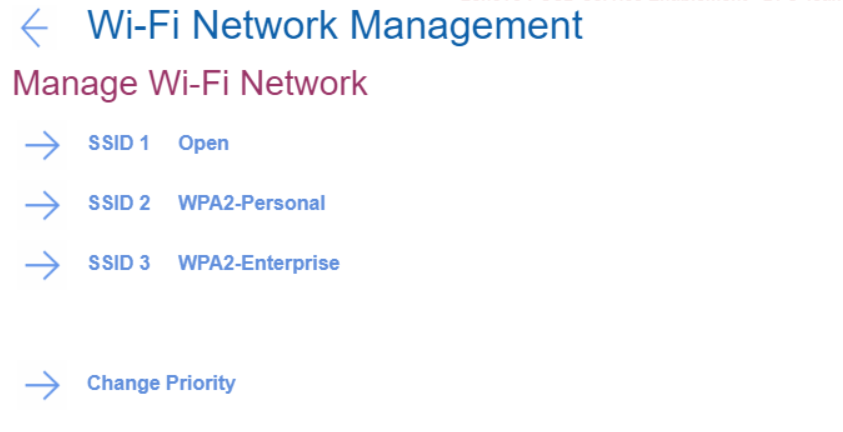
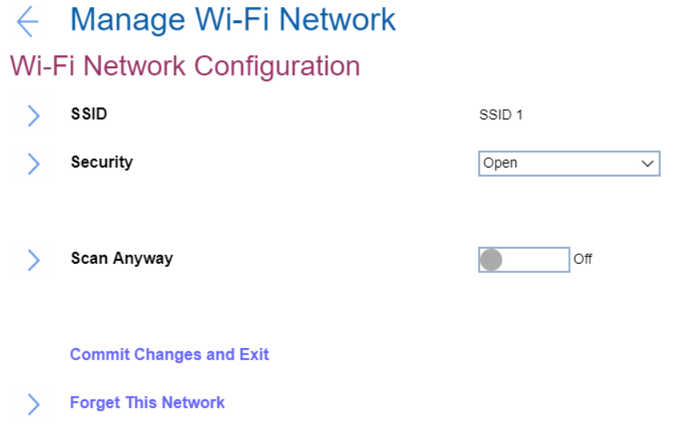
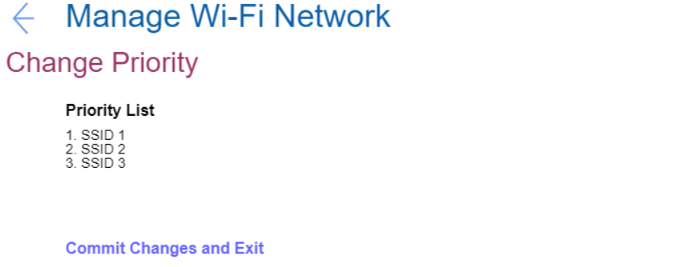

# Manage Wi-Fi Network #

?> All the settings in this group are unavailable via WMI.

[SSID Value][Type] 

SSID value and its type. 

Every SSID on the list leads to details for this network. See descriptions below. 

SSID

Field for editing SSID value.

Security

Select the security type of this Wi-Fi network. Default value depends on the network. Possible values:

1.	Open 
2.	WPA2-Personal
3.	WPA2-Enterprise

Password

Field for entering password.

!> Visible only for a network with security WPA2-Personal.  

Password length: 8-63 characters. 

EAP Authentication Method

Select EAP Authentication Method. Possible values:

1.	**PEAP** – Default
2.	EAP-TLS

!> Visible only for a network with security WPA2-Enterprise.

EAP Second Authentication Method

Select EAP Second Authentication Method. Possible values:

1.	**MSCHAPv2** – Default. 

!> Visible only for a network with security WPA2-Enterprise and if `EAP Authentication Method` is `PEAP`. 

Enroll CA Cert

This is the option to enroll CA (Certification Authority) certificate. Empty by default. 

!> Visible only for networks with security WPA2-Enterprise. 

Enroll Client Cert

This is the option to enroll client certificate. Empty by default. 

!> Visible only for networks with security WPA2-Enterprise and if `EAP Authentication Method` is `EAP-TLS`.

Enroll Client Private Key

This is the option to enroll client private key. Empty by default. 

!> Visible only for networks with security WPA2-Enterprise and if `EAP Authentication Method` is `EAP-TLS`.

Identity

Field to enter identity value if there is any.  

Requirements to identity length: 6-20 characters. 

!> Visible only for a network with security WPA2-Enterprise. 

EAP Password

Field for entering EAP password.  

Requirements to password length: 1-63 characters. 

!> Visible only for a network with security WPA2-Enterprise. 

Scan Anyway

Field to define whether to scan even when this network is not broadcasting its name. Possible options:

1.	On - the network will be scanned when it does not broadcast its name. 
2.	**Off** - the network will not be scanned when it does not broadcast its name. Default.

!> Visible only for a network with security WPA2-Enterprise.

Commit Changes and Exit

This is the option to save changes and exits back to the Manage Wi-Fi network page.

Forget This Network

This is the option to forget the settings for the selected network and disconnect from it. 

Change Priority

Leads to the list of saved Wi-Fi networks.   
T
he option will show a warning message if Network List is empty. See descriptions below. 

Priority List

Contains the list of SSIDs of the saved networks. 

Commit Changes and Exit

This is the option to save changes and exits back to the Manage Wi-Fi network page.

