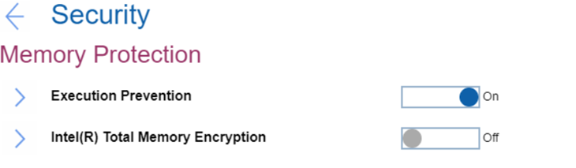

# Memory Protection Settings #

Execution Prevention

One of 2 Possible options:

1.	On – if your OS supports Data Execution Prevention, this setting can prevent virus\worm attacks that create memory buffer overflows by running code where only data is allowed.
2.	**Off** – normal state. Default.

?>  Reset to ‘Off’ if your required applications cannot run.

| WMI Setting name | Values | Locked by SVP | AMD/Intel |
|:---|:---|:---|:---|
| DataExecutionPrevention | Disable, Enable | Yes | Both |

Intel(R) Total Memory Encryption

One of 2 possible states for Total Memory Encryption (TME) to protect DRAM data from physical attacks:

1.	On – TME if on. When enabled, it will have the following impacts:
    * System memory tools, such as memtest86 and Lenovo Diagnostic-Memory test, will not work correctly
    * System performance will degrade by estimated 3-5%.
2.	**Off** – TME is off. Default.

| WMI Setting name | Values | Locked by SVP | AMD/Intel |
|:---|:---|:---|:---|
| TotalMemoryEncryption | Disable, Enable | Yes | Intel |

