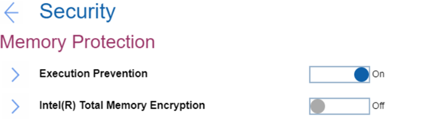

# Memory Protection Settings #

Execution Prevention

If OS supports Data Execution Prevention, prevents virus\worm attacks that create memory buffer overflows by running code where only data is allowed.

Options:

1.	On.
2.	**Off** – normal state. Default.

?> Reset to `Off` if required applications cannot run.

| WMI Setting name | Values | SVP Req'd | AMD/Intel |
|:---|:---|:---|:---|
| DataExecutionPrevention | Disable, Enable | No | Both |

Intel(R) Total Memory Encryption

Total Memory Encryption (TME) protects DRAM data from physical attacks

Options:

1.	On – TME if on. When enabled, it will have the following impacts:
    * System memory tools, such as memtest86 and Lenovo Diagnostic-Memory test, will not work correctly
    * System performance will degrade by estimated 3-5%.
2.	**Off** – TME is off. Default.

| WMI Setting name | Values | SVP Req'd | AMD/Intel |
|:---|:---|:---|:---|
| TotalMemoryEncryption | Disable, Enable | No | Intel |

