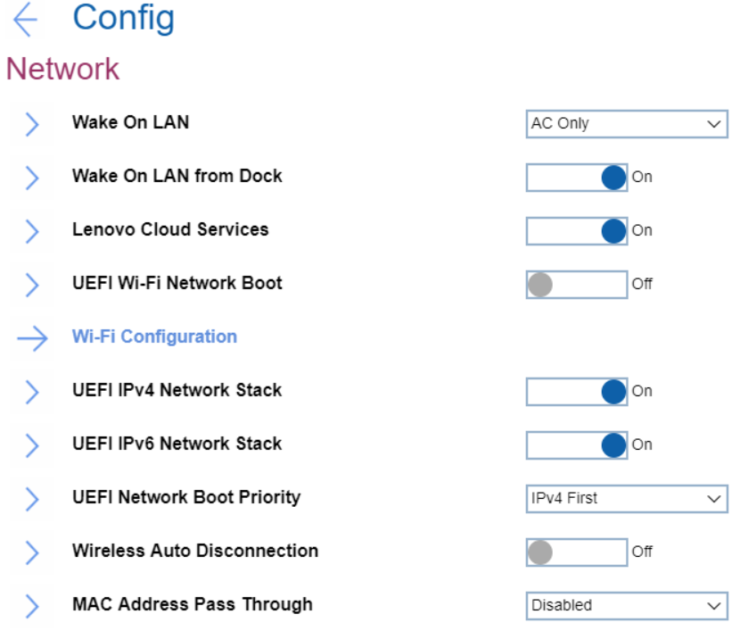
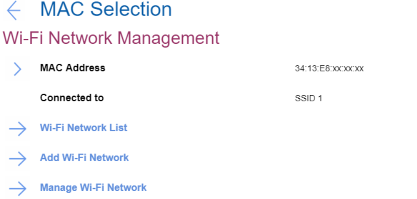
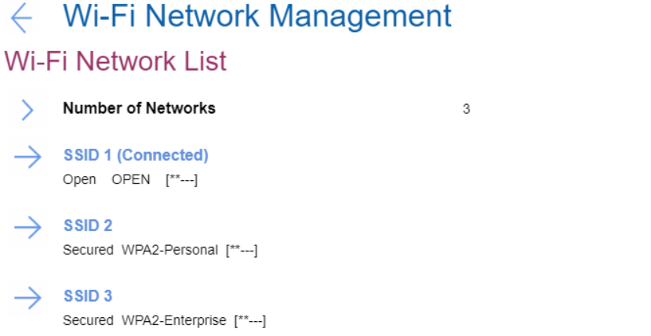
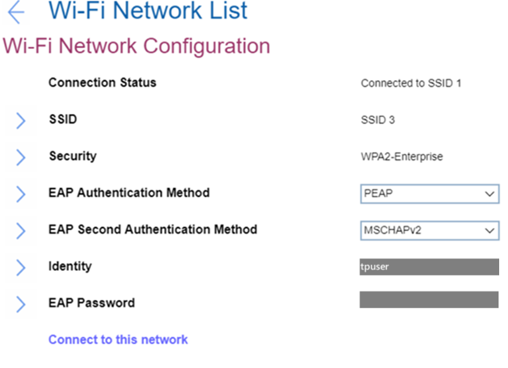
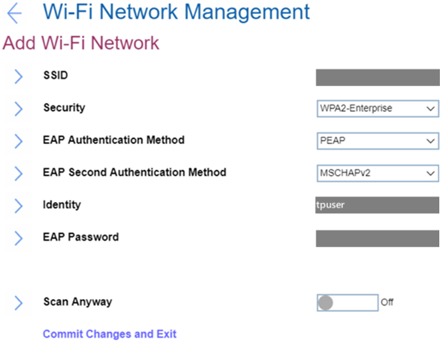
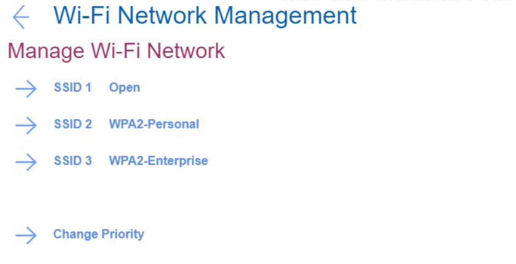
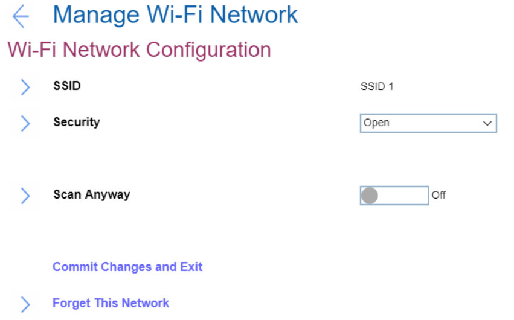
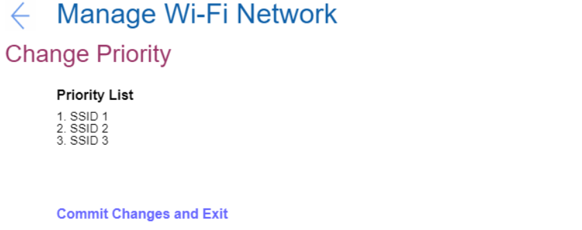

# Network Settings #
### General ###

Wake On Lan

One of 3 possible states:  

1.	**AC Only** - Wake On LAN function works only when AC is attached. Default.
2.	Disabled - function is turned off. 
3.	AC and Battery - Wake On LAN function works with both AC and Battery.

**Note**: AC is required with magic packet type Wake On LAN. 
Wake On LAN function may be blocked due to password configuration.

| WMI Setting name | Values | SVP Req'd | AMD/Intel |
|:---|:---|:---|:---|
| WakeOnLAN | Disable, ACOnly, ACandBattery, Enable | No | Both |

Wake On LAN from Dock

One of 2 possible states:

1.	**On** - function is turned on. Default.

   **Note**: This feature will not work while Secure Boot is disabled.

2.	Off - function is turned off. 

   **Note**: Wake On LAN from Dock works only when ThinkPad USB-C Dock or ThinkPad Thunderbolt Dock is attached.
Wake on LAN from Dock function may be blocked due to password configuration.

| WMI Setting name | Values | SVP Req'd | AMD/Intel |
|:---|:---|:---|:---|
| WakeOnLANDock  | Disable, Enable | No | Both |

Lenovo Cloud Services

One of 2 possible states:

1.	**On** - function is turned on. System connects Lenovo Cloud Services via HTTPs. DHCP option settings are not required. Default.

   **Note**: This feature will not work while Secure Boot is disabled.

2.	Off - function is turned off. 

**Additional information** 
Once the feature is enabled,  then it becomes available for selection in “BIOS -> Startup -> Edit Boot Order”, or “BIOS -> Startup -> Network Boot”, or via F12 Boot Menu. 
When “Lenovo Cloud Services” booted, then following options will be available for selection:
1. **Lenovo Cloud Deploy (ITC)** – it is a method to send Factory-Style images to customers for deployment in the field. 
Additional information is here: [Lenovo Cloud Deploy](https://www.lenovoclouddeploy.com/en/auth/welcome)
2. **Windows Virtual Desktop (VDI)** – it provides the VDI environment to customer. VDI itself will be setup by the customer (IT Admin). If this option is selected, then it will become available as a boot option.  
Additional information is here: [Client Virtualization & Infrastructure Solutions - Lenovo](https://www.lenovo.com/lt/lt/data-center/solutions/client-virtualization) and [Windows Virtual Desktop](https://www.microsoft.com/en-us/microsoft-365/blog/2019/09/30/windows-virtual-desktop-generally-available-worldwide/).

| WMI Setting name | Values | SVP Req'd | AMD/Intel |
|:---|:---|:---|:---|
| LenovoCloudServices  | Disable, Enable | No | Intel |

UEFI WI-FI Network Boot

One of 2 possible states: 

1. On - function is turned on. UEFI Wi-Fi driver is loaded at next boot and can connect to Access point.
2. **Off** - function is turned off. Default.

**Note**: Secure Boot must be enabled to use UEFI Network Boot.

| WMI Setting name | Values | SVP Req'd | AMD/Intel |
|:---|:---|:---|:---|
| WiFiNetworkBoot  | Disable, Enable | No | Intel |

UEFI IPv4 Network Stack

One of 2 possible states: 

1. **On** - function is turned on. UEFI IPv4 Network Stack for UEFI environment is enabled. Default.
2. Off - function is turned off.

| WMI Setting name | Values | SVP Req'd | AMD/Intel |
|:---|:---|:---|:---|
| IPv4NetworkStack  | Disable, Enable | No | Both |

UEFI IPv6 Network Stack

One of 2 possible states: 

1. **On** - function is turned on. UEFI IPv6 Network Stack for UEFI environment is enabled. Default.
2. Off - function is turned off.

| WMI Setting name | Values | SVP Req'd | AMD/Intel |
|:---|:---|:---|:---|
| IPv6NetworkStack  | Disable, Enable | No | Both |

UEFI Network Boot Priority

One of 2 possible options for Network Stack priority for UEFI PXE Boot: 

1. **IPv4 First** – Default.
2. IPv6 First

| WMI Setting name | Values | SVP Req'd | AMD/Intel |
|:---|:---|:---|:---|
| UefiPxeBootPriority  | IPv6First, IPv4First | No | Both |

Wireless Auto Disconnection

One of 2 possible states for Wireless Auto Disconnection feature when Ethernet cable is connected to Ethernet LAN on system: 

1. On - function is turned on. Wireless LAN radios is automatically turned off whenever Ethernet cable is connected.
2. **Off** - function is turned off. Default.

| WMI Setting name | Values | SVP Req'd | AMD/Intel |
|:---|:---|:---|:---|
| WirelessAutoDisconnection  | Disable, Enable | No | Both |

MAC Address Pass Through

One of 3 possible options for MAC Address Pass Through function when dock is attached: 

1. **Disabled** - Dock Ethernet uses its own MAC address. Default
2. Internal MAC Address - Dock Ethernet uses same MAC address as internal LAN.
3. Second MAC Address - Dock Ethernet uses the second MAC address that is stored in the system's EEPROM. This allows for a device-specific MAC address that is different from the internal NIC's MAC address so they can be managed separately if necessary. 

For systems that do not have an internal NIC, there will only be two options:  off, which means the dock will use it's own MAC Address; or on, which means the dock will use MAC address stored in the system EEPROM.

| WMI Setting name | Values | SVP Req'd | AMD/Intel |
|:---|:---|:---|:---|
| MACAddressPassThrough  | Disable, Enable, Second | No | Both |

### WiFi Configuration ###

**Note**. All the settings in this group are not available via WMI.

MAC Address

Media access control (MAC) address of the wireless network interface controller. View only.
Note. There could be several MAC addresses in case there are several wireless network interface controllers. 
 
For every MAC Address the following information is shown: 

* MAC Address - Media access control (MAC) address of the selected wireless network interface controller. View only.
* [State] - One of 2 possible states: 
   1. **Disconnected** - device is not connected to a Wi-Fi network. Default.
   2. Connected to [SSID] - device is connected to a Wi-Fi network which has displayed SSID.

 

### Wi-Fi Network List ###

**Note**. All the settings in this group are not available via WMI.

**Number of networks:** Number of current available networks around. View only.

For each network the Security Type is shown.  Possible values are "Open" and "Secured".  If Secured, the security type is displayed. This is view only.

Each SSID can be selected to display more details.

[SSID Value](Status)

Connection Status

View only. One of 2 possible statuses:

1.	**Disconnected** - device is not connected to this Wi-Fi network. Default.
2.	Connected - device is connected to this Wi-Fi network.    

SSID

SSID (Service Set Identifier) is the name of the wireless network. View only.

Security

Security type of this Wi-Fi network. View only.Possible values:

1.	Open
2.	WPA2-Personal
3.	WPA2-Enterprise
4. PEAP
5. EAP-TLS

   

Password

Field for entering password. Visible only for networks with security WPA2-Personal. 
Password length: 8-63 characters.

EAP Authentication Method

Selected EAP Authentication Method. View only. Visible only for networks with security WPA2-Enterprise. Default value depends on the network. Possible values:

1. PEAP
2.	EAP-TLS 

EAP Second Authentication Method

Selected EAP Second Authentication Method. View only. Visible only for networks with security WPA2-Enterprise and if ‘EAP Authentication Method’ is ‘PEAP’. Default value depends on the network. Possible values:

1. MSCHAPv2

Enroll CA Cert

This is the option to enroll CA (Certification Authority) certificate. Empty by default.
Visible only for networks with security WPA2-Enterprise.

Enroll Client Cert

This is the option to enroll client certificate. Empty by default.
Visible only for networks with security WPA2-Enterprise and if ‘EAP Authentication Method’ is ‘EAP-TLS’.

Enroll Client Private Key

This is the option to enroll client private key. Empty by default.
Visible only for networks with security WPA2-Enterprise and if ‘EAP Authentication Method’ is ‘EAP-TLS’.

Identity

Identity value if there is any. View only.Identity length: 6-20 characters.
Visible only for networks with security WPA2-Enterprise.

EAP Password

Field for entering EAP password. Requirements to password length: 1-63 characters.
Visible only for networks with security WPA2-Enterprise.

[Action]

One of 2 possible actions:

1.	Connect to this network - visible if device is not connected to this Wi-Fi network
2.	Disconnect - visible if device is connected to this Wi-Fi network

 

### Add Wi-Fi Network ###

**Note**. All the settings in this group are not available via WMI.

SSID

Field for entering SSID value.

Security

Field to select the security type of this Wi-Fi network. Possible values:

1.	**Open** – Default
2.	WPA2-Personal
3.	WPA2-Enterprise

Password

Field for entering password. Visible only for a network with security WPA2-Personal. 
Password length: 8-63 characters.

EAP Authentication Method

Field to select EAP Authentication Method. Possible values:

1.	**PEAP** – Default
2.	EAP-TLS

Visible only for a network with security WPA2-Enterprise. 

EAP Second Authentication Method

Field to select EAP Second Authentication Method. Possible values:

1.	**MSCHAPv2** – Default. 

Visible only for a network with security WPA2-Enterprise and if ‘EAP Authentication Method’ is ‘PEAP’. 

Enroll CA Cert

This is the option to enroll CA (Certification Authority) certificate. Empty by default. 
Visible only for networks with security WPA2-Enterprise.

Enroll Client Cert

This is the option to enroll client certificate. Empty by default. 
Visible only for networks with security WPA2-Enterprise and if ‘EAP Authentication Method’ is ‘EAP-TLS’.

Enroll Client Private Key

This is the option to enroll client private key. Empty by default. 
Visible only for networks with security WPA2-Enterprise and if ‘EAP Authentication Method’ is ‘EAP-TLS’.

Identity

Field for entering identity value if there is any.  
Requirements to identity length: 6-20 characters. 
Visible only for a network with security WPA2-Enterprise. 

EAP Password

Field for entering EAP password.  
Requirements to password length: 1-63 characters. 
Visible only for a network with security WPA2-Enterprise. 

Scan Anyway

Field to define whether to scan even when this network is not broadcasting its name. One of 2 possible options:

1.	**On** - the network will be scanned when it does not broadcast its name. Default. 
2.	Off - the network will not be scanned when it does not broadcast its name.

Visible only for a network with security WPA2-Enterprise.

Commit Changes and Exit

This is the option to save changes and exits back to the Manage Wi-Fi network page. 

### Manage Wi-Fi Network ###

**Note**. All the settings in this group are not available via WMI.

[SSID Value][Type] 

SSID value and its type. 
Every SSID on the list leads to details for this network. See descriptions below. 

SSID

Field for editing SSID value. 

Security

Field to select the security type of this Wi-Fi network. Default value depends on the network. Possible values:

1.	Open 
2.	WPA2-Personal
3.	WPA2-Enterprise

Password

Field for entering password. Visible only for a network with security WPA2-Personal.  
Password length: 8-63 characters. 

EAP Authentication Method

Field to select EAP Authentication Method. Possible values:

1.	**PEAP** – Default
2.	EAP-TLS

Visible only for a network with security WPA2-Enterprise.

EAP Second Authentication Method

Field to select EAP Second Authentication Method. Possible values:

1.	**MSCHAPv2** – Default. 

Visible only for a network with security WPA2-Enterprise and if ‘EAP Authentication Method’ is ‘PEAP’. 

Enroll CA Cert

This is the option to enroll CA (Certification Authority) certificate. Empty by default. 
Visible only for networks with security WPA2-Enterprise. 

Enroll Client Cert

This is the option to enroll client certificate. Empty by default. 
Visible only for networks with security WPA2-Enterprise and if ‘EAP Authentication Method’ is ‘EAP-TLS’.

Enroll Client Private Key

This is the option to enroll client private key. Empty by default. 
Visible only for networks with security WPA2-Enterprise and if ‘EAP Authentication Method’ is ‘EAP-TLS’.

Identity

Field to enter identity value if there is any.  
Requirements to identity length: 6-20 characters. 
Visible only for a network with security WPA2-Enterprise. 

EAP Password

Field for entering EAP password.  
Requirements to password length: 1-63 characters. 
Visible only for a network with security WPA2-Enterprise. 

Scan Anyway

Field to define whether to scan even when this network is not broadcasting its name. One of 2 possible options:

1.	On - the network will be scanned when it does not broadcast its name. 
2.	**Off** - the network will not be scanned when it does not broadcast its name. Default.

Visible only for a network with security WPA2-Enterprise.

Commit Changes and Exit

This is the option to save changes and exits back to the Manage Wi-Fi network page.

Forget This Network

This is the option to forget the settings for the selected network and disconnect from it. 

Change Priority

Leads to the list of saved Wi-Fi networks.   
The option will show a warning message if Network List is empty. See descriptions below. 

Priority List

Contains the list of SSIDs of the saved networks. 

Commit Changes and Exit

This is the option to save changes and exits back to the Manage Wi-Fi network page.

