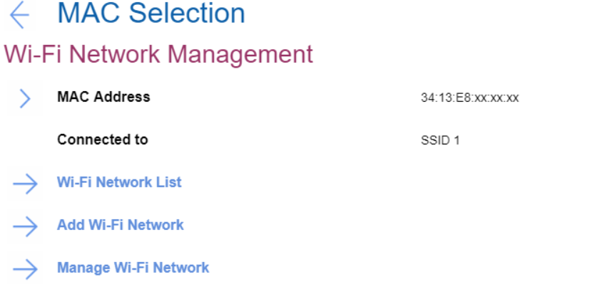
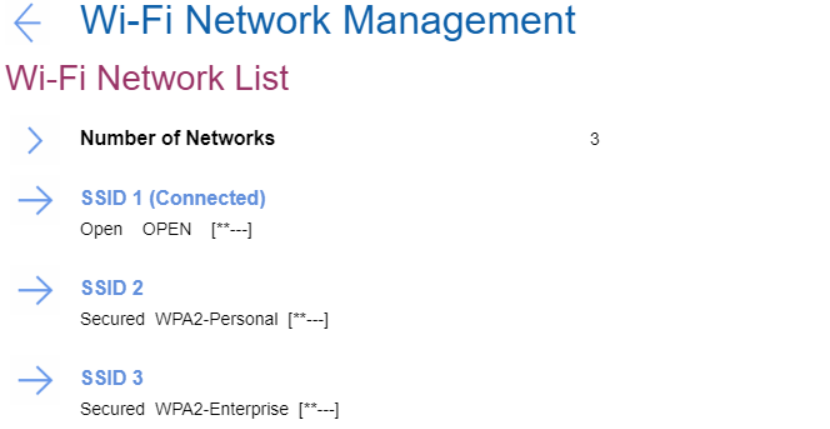

# Network Settings #

### General ###

Wake On Lan

Options:

1.	**AC Only** - Wake On LAN only when AC is attached. Default.
2.	Disabled. 
3.	AC and Battery - Wake On LAN with both AC and Battery.

!> AC is required with magic packet type Wake On LAN. 

!> Wake On LAN may be blocked due to password configuration.

| WMI Setting name | Values | SVP Req'd | AMD/Intel |
|:---|:---|:---|:---|
| WakeOnLAN | Disable, ACOnly, ACandBattery, Enable | No | Both |

Wake On LAN from Dock

Options:

1.	**On** - Default.
2.	Off. 

!> Will not work while Secure Boot is disabled.

!> Wake On LAN from Dock works only when ThinkPad USB-C Dock or ThinkPad Thunderbolt Dock is attached.

!> Wake on LAN from Dock may be blocked due to password configuration.

| WMI Setting name | Values | SVP Req'd | AMD/Intel |
|:---|:---|:---|:---|
| WakeOnLANDock  | Disable, Enable | No | Both |

Lenovo Cloud Services

Options:

1.	**On**. System connects Lenovo Cloud Services via HTTPs. DHCP option settings are not required. Default.
2.	Off. 

!> Will not work while Secure Boot is disabled.

**Additional information** 
Once enabled, the feature is available in:
 - BIOS -> Startup -> Edit Boot Order
 - BIOS -> Startup -> Network Boot
 - F12 Boot Menu

When “Lenovo Cloud Services” booted, the following will be available:
1. **Lenovo Cloud Deploy (ITC)** – sends Factory-Style images to customers for deployment in the field. 
More information: [Lenovo Cloud Deploy](https://www.lenovoclouddeploy.com/en/auth/welcome)
2. **Windows Virtual Desktop (VDI)** – provides the VDI environment to customer. VDI will be setup by the customer (IT Admin). If selected, will become available as a boot option.  
More information: [Client Virtualization & Infrastructure Solutions - Lenovo](https://www.lenovo.com/lt/lt/data-center/solutions/client-virtualization) and [Windows Virtual Desktop](https://www.microsoft.com/en-us/microsoft-365/blog/2019/09/30/windows-virtual-desktop-generally-available-worldwide/).

| WMI Setting name | Values | SVP Req'd | AMD/Intel |
|:---|:---|:---|:---|
| LenovoCloudServices  | Disable, Enable | No | Intel |

UEFI WI-FI Network Boot

Options: 

1. On. UEFI Wi-Fi driver is loaded at next boot and can connect to Access point.
2. **Off**. Default.

!> Secure Boot must be enabled to use UEFI Network Boot.

| WMI Setting name | Values | SVP Req'd | AMD/Intel |
|:---|:---|:---|:---|
| WiFiNetworkBoot  | Disable, Enable | No | Intel |

UEFI IPv4 Network Stack

Whether to turn on UEFI IPv4 Network Stack for UEFI environment.

Options: 

1. **On** - Default.
2. Off.

| WMI Setting name | Values | SVP Req'd | AMD/Intel |
|:---|:---|:---|:---|
| IPv4NetworkStack  | Disable, Enable | No | Both |

UEFI IPv6 Network Stack

Whether to turn on UEFI IPv6 Network Stack for UEFI environment.

Options: 

1. **On** - Default.
2. Off.

| WMI Setting name | Values | SVP Req'd | AMD/Intel |
|:---|:---|:---|:---|
| IPv6NetworkStack  | Disable, Enable | No | Both |

UEFI Network Boot Priority

Network Stack priority for UEFI PXE Boot.

Options: 

1. **IPv4 First** – Default.
2. IPv6 First

| WMI Setting name | Values | SVP Req'd | AMD/Intel |
|:---|:---|:---|:---|
| UefiPxeBootPriority  | IPv6First, IPv4First | No | Both |

Wireless Auto Disconnection

Whether Wireless LAN radio is automatically turned off whenever Ethernet cable is connected.

Options: 

1. On.
2. **Off**. Default.

| WMI Setting name | Values | SVP Req'd | AMD/Intel |
|:---|:---|:---|:---|
| WirelessAutoDisconnection  | Disable, Enable | No | Both |

MAC Address Pass Through

Which MAC Address to use for Dock Ethernet when dock is attached.

Options: 

1. **Disabled** - Dock Ethernet uses its own MAC address. Default.
2. Internal MAC Address - Dock Ethernet uses same MAC address as internal LAN.
3. Second MAC Address - Dock Ethernet uses the second MAC address that is stored in the system's EEPROM.

?> `Second MAC Address` allows for a device-specific MAC address that is different from the internal NIC's MAC address so they can be managed separately if necessary.

?> For systems that do not have an internal NIC, there will only be two options:   - off: the dock will use its own MAC Address   - on: the dock will use MAC address stored in the system EEPROM

| WMI Setting name | Values | SVP Req'd | AMD/Intel |
|:---|:---|:---|:---|
| MACAddressPassThrough  | Disable, Enable, Second | No | Both |

### WiFi Configuration -> MAC Selection ###

?> All the settings in this group are unavailable via WMI.

### MAC Address (display only) ###

Media access control (MAC) address of the wireless network interface controller.

?> There could be several MAC addresses, if there is more than one wireless network interface controller. 

For every MAC Address the following information is shown: 

* MAC Address - Media access control (MAC) address of the selected wireless network interface controller. 
* Whether device is connected to a Wi-Fi network. Possible states: 
   1. **Disconnected** -  Default.
   2. Connected to {SSID} - connected to Wi-Fi network with this SSID.

### Wi-Fi Network List (display only) ###

?> All the settings in this group are unavailable via WMI.

**Number of networks:** Number of current available networks around.

For each network the Security Type is shown.

Possible values:
- Open.
- Secured.

?> If set to `Secured`, the security type is displayed.

Each SSID can be selected to display more details.

