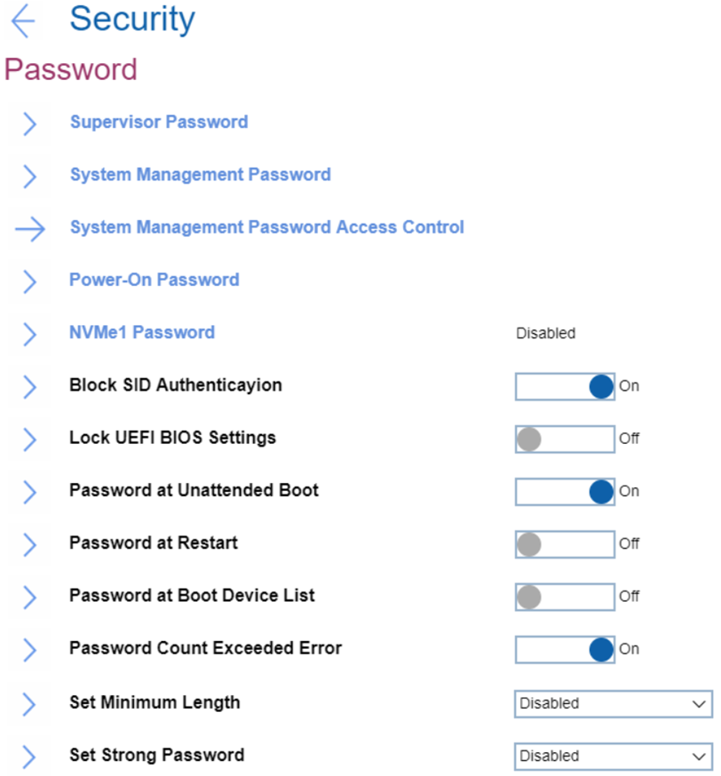
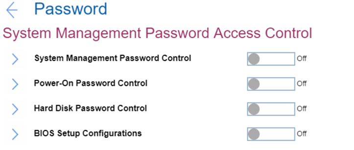

# Password Settings #
### General ###

Supervisor Password

The Supervisor Password (SVP) protects the system information stored in UEFI BIOS. When entering the UEFI BIOS menu, enter the correct supervisor password in the window prompted. You also can press Enter to skip the password prompt. However, you cannot change most of the system configuration options in UEFI BIOS.

**The supervisor password can be set only through the UEFI BIOS menu.** Once it is in place, then it can be modified Windows Management Instrumentation (WMI) with the Lenovo client-management interface.

If you have set both the supervisor password and power-on password, you can use the supervisor password to access your computer when you turn it on. The supervisor password overrides the power-on password. 

One of 2 possible states:
1.	**Disabled** - no password defined. Default.
2.	Enabled - for enabling system will request to set and confirm password.  
While enabling the following parameters are available:

* 2.1 [Enter New Password]
* 2.2 [Confirm New Password]
* 2.3 Show Password – [On\Off] statuses
* 2.4 Keyboard layout: XXXX – Possible values are the same as in [Keyboard\Mouse -> Keyboard Layout](bios/settings/thinkpad/keyboardmouse.md)  
* 2.5 < Actions >: 
    2.5.1. **Save** – default 
    2.5.2. Cancel 

When enabled Supervisor Password prevents unauthorized users from accessing these items in ThinkPad Setup:
* Boot priority lists
* Network related items
* Date & Time

**Note**. To have a beep sound when the system is waiting for this password, enable the [Password Beep feature in the Alarm submenu](bios/settings/thinkpad/beepalarm.md).

| WMI Setting name | Values |
|:---|:---|
| pap |  |

System Management Password

The System Management Password (SMP) can also protect the system information stored in UEFI BIOS like a supervisor password, but it has lower authority by default. 
The system management password can be set through the UEFI BIOS menu or through Windows Management Instrumentation (WMI) with the Lenovo
client-management interface. 
You can enable the system management password to have the same authority as the supervisor password to control security-related features.

One of 2 possible states:
1.	**Off** - no password defined. Default.
2.	On - for enabling system will request to set and confirm password.  
While enabling the following parameters are available:

* 2.1 [Enter New Password]
* 2.2 [Confirm New Password]
* 2.3 Show Password – [On\Off] statuses
* 2.4 Keyboard layout: XXXX – Possible values are the same as in [Keyboard\Mouse -> Keyboard Layout](bios/settings/thinkpad/keyboardmouse.md)  
* 2.5 < Actions >: 
    2.5.1. **Save** – default 
    2.5.2. Cancel 

When enabled System Management Password presents unauthorized users from accessing these items in ThinkPad Setup:

* Boot priority lists
* Network related items
* Date & Time

**Note**. To have a beep sound when the system is waiting for this password, enable the [Password Beep feature in the Alarm submenu](bios/settings/thinkpad/beepalarm.md).

| WMI Setting name | Values |
|:---|:---|
| smp |  |

Power-On Password

One of 2 possible states:

1.	**Off** - no password defined. Default.
2.	On - for enabling system will request to set and confirm password.  
While enabling the following parameters are available:

* 2.1 [Enter New Password]
* 2.2 [Confirm New Password]
* 2.3 Show Password – [On\Off] statuses
* 2.4 Keyboard layout: XXXX – Possible values are the same as in [Keyboard\Mouse -> Keyboard Layout](bios/settings/thinkpad/keyboardmouse.md)  
* 2.5 < Actions >: 
    2.5.1. **Save** – default 
    2.5.2. Cancel 

When enabled Power-On Password prevents unauthorized users from booting your computer.

**Note**. To have a beep sound when the system is waiting for this password, enable the [Password Beep feature in the Alarm submenu](bios/settings/thinkpad/beepalarm.md).

| WMI Setting name | Values |
|:---|:---|
| pop |  |

NVMe1 Password

Also known as Hard Disk Password (HDP). 
Lenovo BIOS supports both ATA and NVMe storage and the option (Hard disk password/NVMe password) changes depending on the attached storage device.

The NVMe (nonvolatile memory express) password prevents unauthorized access to the data on the storage drive. When an NVMe password is set, you are prompted to type a correct password each time you try to access the storage drive.  
The system can create dual passwords for an Admin and another User.

One of 2 possible states:

1.	**Off** - no password defined. Default.
2.	On - for enabling system will request 'Setup Confirmation' and 'Password and confirmation'.

Setup Confirmation:

1. **Single Password** - when a Single NVMe password is set, the user must enter the user NVMe password to access files and applications on the storage drive. Default.
2. Dual Password (User+Admin) - The admin NVMe password is set and used by a system administrator. It enables the administrator to access any storage drive in a system or any computer connected in the same network. The administrator can also assign a user NVMe password for each computer in the network. The user of the computer can change the user NVMe password as desired, but only the administrator can remove the user NVMe password. 
3. Cancel 

Password and confirmation:
1. [Enter New Password]
2. [Confirm New Password]
3. Show Password – [On\Off] statuses
4. Keyboard layout: XXXX – Possible values are the same as in [Keyboard\Mouse -> Keyboard Layout](bios/settings/thinkpad/keyboardmouse.md)  
5. < Actions >: 
    5.1. **Save** – default 
    5.2. Cancel 

**Note**. To have a beep sound when the system is waiting for this password, enable the [Password Beep feature in the Alarm submenu](bios/settings/thinkpad/beepalarm.md).

When prompted to enter an NVMe password, press F1 to switch between the admin NVMe password and user NVMe password.

**Notes**: The NVMe password is not available in the following situations:

* A Trusted Computing Group (TCG) Opal-compliant storage drive and a TCG Opal management software program are installed in the computer, and the TCG Opal management software program is activated.
* For Intel models, when an eDrive storage drive is installed in the computer preinstalled with the Windows 10 operating system.

[More information about passwords on support.lenovo.com.](https://support.lenovo.com/at/en/solutions/ht036206-types-of-password-for-thinkpad)

| WMI Setting name for Hard Disk Password (HDP) | Values |
|:---|:---|
| **uhdp1** : Single Password or Dual Password User 1 |  |
| **mhdp1** : Master HDP 1 |  |
| **uhdp2** : Single Password or Dual Password User 2 |  |
| **mhdp2** : Master HDP 2 |  |
| **uhdp3** : Single Password or Dual Password User 3 |  |
| **mhdp3** : Master HDP 3 |  |

| WMI Setting name for NVMe1 Password | Values |
|:---|:---|
| **adrp1** : Single Password or Dual Password Admin 1 |  |
| **udrp1** : Dual Password User 1 |  |
| **adrp2** : Single Password or Dual Password Admin 2 |  |
| **udrp2** : Dual Password User 2 |  |

Block SID Authentication

One of 2 possible states:

1.	**On** - TCG (Trusted Computing Group) Storage device will block attempts to authenticate the SID (Security Identifier) authority until a subsequent device power cycle occurs. Default.
2.	Off - allow SID authentication in TCG Storage device at the next system boot only, not all subsequent boots.

| WMI Setting name | Values |
|:---|:---|
| BlockSIDAuthentication |  |

Lock UEFI BIOS Settings

One of 2 possible states:

1.	On - lock is enabled. When enabled 'Lock UEFI BIOS Settings' prevents users from making any changes in ThinkPad Setup without entering a Supervisor Password.
2.	**Off** - lock is disabled. Default.

**Note**. UEFI BIOS Lock will not take effect unless Supervisor password is enabled.

| WMI Setting name | Values |
|:---|:---|
| LockBIOSSetting |  |

Password at Unattended Boot

One of 2 possible states:

1.	**On** - the system to prompt for passwords when the system starts from full off state or hibernate by unattended events. Default.
2.	Off - passwords are not prompted and continue to boot the OS.

    **Note**. To protect unauthorized access to the system it is recommended to set user authentication on the OS.

| WMI Setting name | Values |
|:---|:---|
| BIOSPasswordAtUnattendedBoot |  |

Password at Restart

One of 2 possible states:

1.	On - the system to prompt for passwords when the system restarts.
2.	**Off** - passwords are not prompted and continue to boot the OS. Default.

    **Note**. To protect unauthorized access to the system it is recommended to set user authentication on the OS.

| WMI Setting name | Values |
|:---|:---|
| BIOSPasswordAtReboot |  |

Password at Boot Device List

If the Security password is set, this option is used to specify whether the Security password must be entered to display the F12 boot device list. 
One of 2 possible states:

1.	On - system will prompt for the Security password.
2.	**Off** - system will proceed without any user action required. Default. 

| WMI Setting name | Values |
|:---|:---|
| BIOSPasswordAtBootDeviceList |  |

Password Count Exceeded Error

One of 2 possible states:

1.	**On** - system will show POST 0199 error when a wrong supervisor password is entered more than three times and prompt for the Security password. Default.
2.	Off - hide the POST 0199 error and proceed without any user action required. 

| WMI Setting name | Values |
|:---|:---|
| PasswordCountExceededError |  |

Set Minimum Length

If a minimum is set, then Supervisor Password, System Management Password, Power-On and Hard Disk password lengths must be equal or longer than that number. 
One of 9 options:

1.	**Disabled** - passwords can be from 1 to 128 symbols. Default. 
2.	4 characters
3.	5 characters
4.	6 characters
5.	8 characters
6.	9 characters
7.	10 characters
8.	11 characters
9.	12 characters

**Note**. If a supervisor password is set, you cannot change the minimum length until you log in as a supervisor.

| WMI Setting name | Values |
|:---|:---|
| MinimumPasswordLength |  |

Set Strong Password

One of 2 possible options:

1.	**Disabled** - no specific requirements to passwords. Default. 
2.	Enabled - Supervisor Password, System Management Password, Power-On and Hard Disk password lengths must be equal or longer than 8 characters, must include at least one uppercase character, one lowercase character and one number.

| WMI Setting name | Values |
|:---|:---|
| StrongPassword |  |

### System Management Password Access Control ###

System Management Password Control

One of 2 possible options:

1.	**Off** – Default.
2.	On – allow System Management Password to have the same authority as Supervisor Password to control System Management Password.

| WMI Setting name | Values |
|:---|:---|
| SystemManagementPasswordControl |  |

Power-On Password Control

One of 2 possible options:

1.	**Off** - Default.
2.	On - allow System Management Password to have the same authority as Supervisor Password to control Power-On Password.

| WMI Setting name | Values |
|:---|:---|
| PowerOnPasswordControl |  |

Hard Disk Password Control

One of 2 possible options:

1.	**Off** - Default.
2.	On - allow System Management Password to have the same authority as Supervisor Password to control Hard Disk Password.

| WMI Setting name | Values |
|:---|:---|
| HardDiskPasswordControl |  |

BIOS Setup Configurations

One of 2 possible options:

1.	**Off** - Default.
2.	On - allow System Management Password to have the same authority as Supervisor Password to control BIOS setup items.

| WMI Setting name | Values |
|:---|:---|
| BIOSSetupConfigurations |  |

