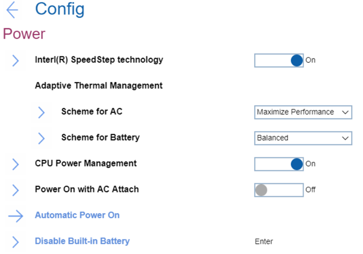
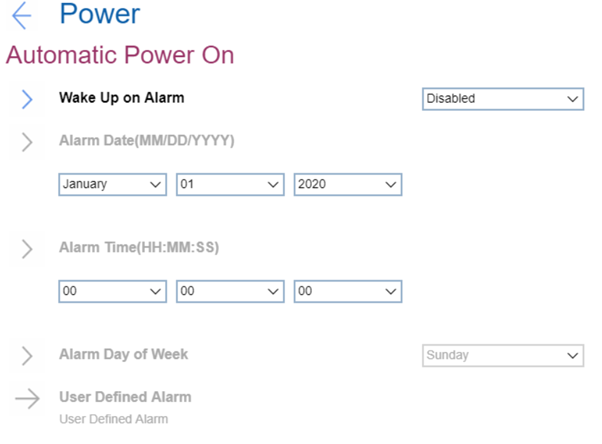

# Power Settings #
### General ###

Intel (R) SpeedStep Technology

One of 2 possible options to select the mode of Intel (R) SteedStep Technology at runtime:

1.	**On** – Intel (R) SpeedStep Technology is turned on. Default.
2.	Off - Intel (R) SpeedStep Technology is turned off.

| WMI Setting name | Values |
|:---|:---|
| SpeedStep |  |

Scheme for AC

One of 2 possible options of thermal management scheme to use:

1.	**Maximize Performance** - reduces CPU throttling. Default.
2.	Balanced - balanced sound, temperature, and performance.

**Note**. Each scheme affects fan sound, temperature, and performance. 

| WMI Setting name | Values |
|:---|:---|
| AdaptiveThermalManagementAC |  |

Scheme for Battery

One of 2 possible options of thermal management scheme to use:

1.	Maximize Performance - reduces CPU throttling.
2.	**Balanced** - balanced sound, temperature, and performance. Default.

**Note**. Each scheme affects fan sound, temperature, and performance.

| WMI Setting name | Values |
|:---|:---|
| AdaptiveThermalManagementBattery |  |

CPU Power Management

One of 2 possible options:

1.	**Enabled** - enabled power saving feature that stops the microprocessor clock automatically when there are no system activities. Default. 
2.	Disabled - disabled power saving feature.

**Note**. Normally, it is not necessary to change this setting.

| WMI Setting name | Values |
|:---|:---|
| CPUPowerManagement |  |

Power On with AC Attach

One of 2 possible options for a feature that powers on the system when AC is attached:

1.	Enabled - the system is powered when AC is attached. When the system is in hibernate state, the system resumes
2.	**Disabled** - the system is not powered on nor resumed when AC is attached. Default.

| WMI Setting name | Values |
|:---|:---|
| OnByAcAttach |  |

Disable Built-in Battery

Option to temporarily disable battery for servicing the system.  
This option requests additional confirmation.  
After selecting this item, the system will be automatically powered off, then ready to be serviced.

**Note**. The battery will be automatically enabled when the AC adapter is reconnected.

### Automatic Power On ###

Wake Up on Alarm

One of 5 possible options for defining when the system shall turn on automatically:

1.	**Disabled** - the system will not turn on automatically. Default.
2.	Single Event - the system will turn on one-time on the specified day and time. 
3.	Daily Event - the system will turn on every day at the specified time.
4.	Weekly Event - the system will turn on every week on the specified day and time.
5.	User Defined - this option enables ‘User Defined Alarm’ group of settings. 

**Note**. Values for the ‘Wake Up on Alarm’ group of settings can be overwritten by the operating system.

| WMI Setting name | Values |
|:---|:---|
|  |  |

Alarm Date (MM/DD/YYYY)

Field to select the exact day for the system to turn on. Active only when ‘Wake Up on Alarm’ has value ‘Single Event’. 
Possible values:

1.	**N/A** – Default.
2.	MM/DD/YYYY: 
    a. MM – Months: January to December  
    b. DD – Date: 1 ~ 31  
    c. YYYY – Year: 1980 ~ 2099  

| WMI Setting name | Values |
|:---|:---|
|  |  |

Alarm Time (HH : MM : SS)

Field to select the exact time for the system to turn on. Active when ‘Wake Up on Alarm’ has one of the values:

* Single Event
* Daily Event
* Weekly Event

Possible values:

1.	**N/A** – Default
2.	HH : MM : SS 
    a. HH - Hour:  00 ~ 23 
    b. MM - Minute:  00 ~ 59 
    c. SS - Second:  00 ~ 59 

| WMI Setting name | Values |
|:---|:---|
|  |  |

Alarm Day of Week

Field to select the exact day for the system to turn on. Active only when ‘Wake Up on Alarm’ has value ‘Weekly Event’.
Possible values:

1.	**N/A** – Default
2.	Sunday
3.	Monday
4.	Tuesday
5.	Wednesday
6.	Thursday
7.	Friday
8.	Saturday

| WMI Setting name | Values |
|:---|:---|
|  |  |

