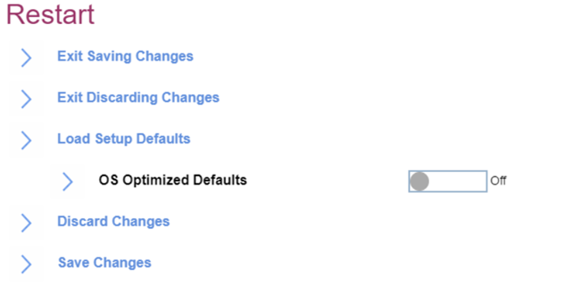

# Restart #

Exit Saving Changes

Exit Setup and save your changes. 
The option requires additional confirmation.

| WMI Setting name | Values |
|:---|:---|
| Not applicable via WMI. |  |

Exit Discarding Changes

Exit Setup without saving changes. The following changes WILL NOT be discarded and must be reset within ThinkPad Setup:

1.	Date & Time
2.	Supervisor Password
3.	Power-on password
4.	Hard disk password

The option requires additional confirmation.

| WMI Setting name | Values |
|:---|:---|
| Not applicable via WMI. |  |

Load Setup Defaults

Load default values for all Setup items. The following changes WILL NO be discarded and must be reset within ThinkPad Setup:

1.	Security
2.	Date & Time

| WMI Setting name | Values |
|:---|:---|
|  |  |

LOS Optimized Defaults

One of 2 possible states:

1.	**Off** - OS Optimized Defaults are disabled. Default.
Note. When switching from ‘Enabled’ state the option will require additional confirmation.
2.	On – the default value of settings below are changed accordingly. Select ‘On’ to meet Microsoft (R) Windows 10 (R) Certification Requirement. 

Affected settings are:

1.	Secure Boot
2.	Secure RollBack Prevention
3.	Virtualization features

| WMI Setting name | Values |
|:---|:---|
| Not applicable via WMI. |  |

Discard Changes

Load previous values for most Setup items. The following changes WILL NOT be discarded and must be reset within ThinkPad Setup:

1.	Date & Time
2.	Supervisor password
3.	Power-on password
4.	Hard disk password

The option requires additional confirmation.

| WMI Setting name | Values |
|:---|:---|
| Not applicable via WMI. |  |

Save Changes

Save Setup data.

| WMI Setting name | Values |
|:---|:---|
|  |  |

