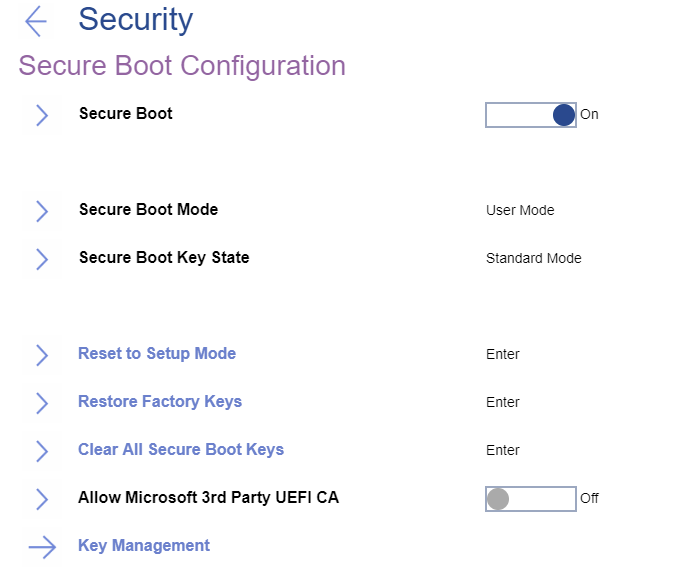

# Secure Boot Settings #
### General ###

Secure Boot

One of 2 possible options:

1.	On – prevent unauthorized operating systems from running at boot time. Default, if ‘OS Optimized Defaults’ has value ‘On’.
2.	Off – allow to run any operating systems at boot time. Default, if ‘OS Optimized Defaults’ has value ‘Off.

| WMI Setting name | Values |
|:---|:---|
| SecureBoot | Disable,Enable |

Secure Boot Mode

Shows whether the platform is operating in one of 2 possible modes:

1.	Setup mode
2.	**User mode** - default.

| WMI Setting name | Values |
|:---|:---|
| Not available via WMI |  |

Secure Boot Key State

Shows whether the secure boot mode is in one of two possible modes:

1.	Custom mode
2.	**Standard mode** - default.

| WMI Setting name | Values |
|:---|:---|
| Not available via WMI |  |

Reset to Setup Mode

This option is used to clear the current Platform Key and put the system into setup mode. You can install your own Platform Key and customize the Secure Boot signature databases in setup mode.
The option requires additional confirmation.

**Note**. Secure Boot Mode will be set to Custom Mode.

| WMI Setting name | Values |
|:---|:---|
| Not available via WMI |  |

Restore Factory Keys

This option is used to restore all keys and certificates in Secure Boot databases to factory defaults. Any customized Secure Boot settings will be erased, and the default Platform key will be re-established along with the original signature databases including certificate for Microsoft (R) Windows 10 (R). 
The option requires additional confirmation.

| WMI Setting name | Values |
|:---|:---|
| Not available via WMI |  |

Clear All Secure Boot Keys

This option is used to clear all keys and certificates in Secure Boot databases. You can install your own keys and certificates after selecting this option. 
The option requires additional confirmation.

| WMI Setting name | Values |
|:---|:---|
| Not available via WMI |  |

### Key Management ###

Platform Key (PK)

The platform key establishes a trust relationship between the platform owner and the platform firmware. The platform owner enrolls the public half of the key into the platform firmware. The platform owner can later use the private half of the key to change platform ownership or to enroll a Key Exchange Key.

| WMI Setting name | Values |
|:---|:---|
| Standard Windows commands are supported. For more information please visit the official Microsoft web page: [Windows Secure Boot Key Creation and Management Guidance](https://docs.microsoft.com/en-us/windows-hardware/manufacture/desktop/windows-secure-boot-key-creation-and-management-guidance) |  |

Key Exchange Key (KEK)

Key exchange keys establish a trust relationship between the operating system and the platform firmware. Each operating system (and potentially, each 3rd party application that needs to communicate with platform firmware) enrolls a public key into the platform firmware.

| WMI Setting name | Values |
|:---|:---|
| Standard Windows commands are supported. For more information please visit the official Microsoft web page: [Windows Secure Boot Key Creation and Management Guidance](https://docs.microsoft.com/en-us/windows-hardware/manufacture/desktop/windows-secure-boot-key-creation-and-management-guidance) |  |

Authorized Signature Database (DB)

Database keys shows the list of allowed certificates. System will check digital signatures of bootloaders using public keys in the DB. Only software or firmware which has a bootloader signed with a corresponding private key will be allowed to run. 

| WMI Setting name | Values |
|:---|:---|
| Standard Windows commands are supported. For more information please visit the official Microsoft web page: [Windows Secure Boot Key Creation and Management Guidance](https://docs.microsoft.com/en-us/windows-hardware/manufacture/desktop/windows-secure-boot-key-creation-and-management-guidance) |  |

Forbidden Signature Database (DBX)

Forbidden Signature Database shows not allowed certificates. System will block any software or firmware signed with a corresponding private key.

| WMI Setting name | Values |
|:---|:---|
| Standard Windows commands are supported. For more information please visit the official Microsoft web page: [Windows Secure Boot Key Creation and Management Guidance](https://docs.microsoft.com/en-us/windows-hardware/manufacture/desktop/windows-secure-boot-key-creation-and-management-guidance) |  |

