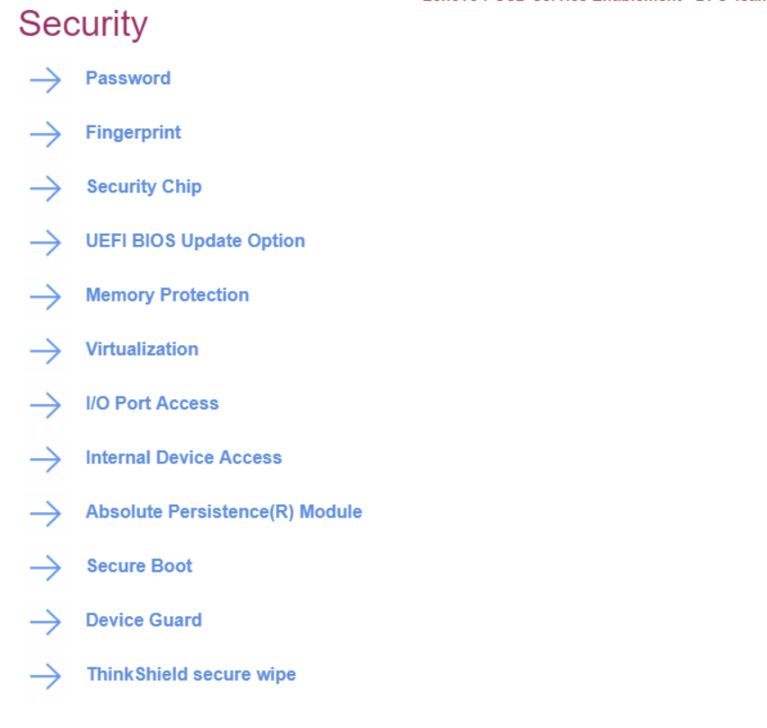

# Security #

TSME

Transparent Secure Memory Encryption (TSME) helps provide protection against cold boot attacks, if an attacker has physical access to the system. Also known as AMD Memory Guard. 
Additional information: [AMD Memory Guard] (https://www.amd.com/system/files/documents/amd-memory-guard-white-paper.pdf) and [ThinkPad Reliability](https://news.lenovo.com/pressroom/press-releases/thinkpad-reliability-amd-ryzen-pro-mobile-processors/) 

One of 2 possible options:

1.	On - TSME is enabled.
2.	**Off** - TSME is disabled. 

| WMI Setting name | Values | SVP Req'd | AMD/Intel |
   |:---|:---|:---|:---|
| TSME | Disable, Enable | Yes | AMD |

