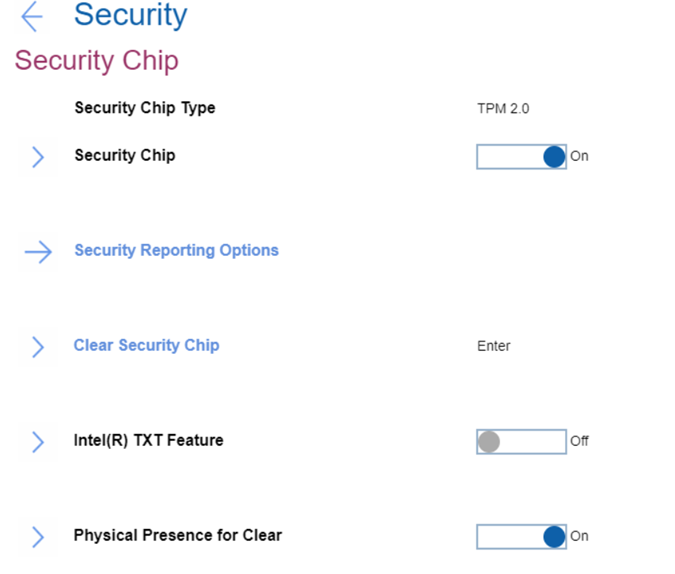
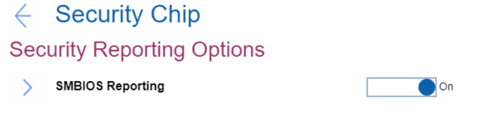

# Security Chip Settings #

### General ###

Security Chip Type

Shows the security chip type. View-only value.

 Read-only value. Available via [standard Windows commands](https://docs.microsoft.com/en-us/powershell/module/trustedplatformmodule/?view=windowsserver2019-ps&preserve-view=true&viewFallbackFrom=win10-ps)

Security Chip

One of 2 possible states:

1.	**On** - security chip is functional. Default.
2.	Off - security chip is hidden and is not functional.

**Note**. If shows ‘MFG Mode’ (manufacturing mode), then TPM (Trusted Platform Module) must be provisioned correctly.

| WMI Setting name | Values | Locked by SVP | AMD/Intel |
|:---|:---|:---|:---|
| SecurityChip | Active, Inactive, Disable, Enable | Yes | Both |

Clear Security Chip

Visible and active only if Security Chip’ is ‘Enabled’. 
This option is used to clear encryption keys. 

**Note**. It will not be possible to access already encrypted data after these keys are cleared.

The option requires additional confirmation for clearing the keys.
 Available via standard Windows commands: [Clear-Tpm](https://docs.microsoft.com/en-us/powershell/module/trustedplatformmodule/clear-tpm?view=windowsserver2019-ps)

Intel(R) TXT Feature

Visible and active only if Security Chip’ is ‘Enabled’. 
Intel (R) Trusted Execution Technology is a hardware-based security foundation to build and maintain a chain of trust, to protect information from software-based attacks. 
One of 2 possible states:

1.	On
2.	**Off** – Default.

| WMI Setting name | Values | Locked by SVP | AMD/Intel |
|:---|:---|:---|:---|
| TXTFeature | Disable, Enable | Yes | Intel |

Physical Presence for Clear

This option enables or disables confirmation of a user’s physical presence when clearing the security chip.
One of 2 possible states:

1.	**On** - display user confirmation screen when clearing. Default.
2.	Off - No user confirmation screen when clearing.

| WMI Setting name | Values | Locked by SVP | AMD/Intel |
|:---|:---|:---|:---|
| PhysicalPresenceForTpmClear  | Disable, Enable | Yes | Both |

**Note**. It is possible to change the value from Enable to Disable only when Supervisor Password exists, because it is required to confirm the action.

### Security Reporting Options ###

Visible and active only if Security Chip’ is ‘Enabled’.  
Opens settings for Security Reporting Options.

SMBIOS Reporting

One of 2 possible states:

1.	**On** - reporting of SMBIOS data is enabled. Changes to corresponding UEFI BIOS data are logged in a location, (PCR1, defined in the TCG standards), which other authorized programs can monitor, read, and analyze. Default.
2.	Off - reporting of SMBIOS data is disabled.

