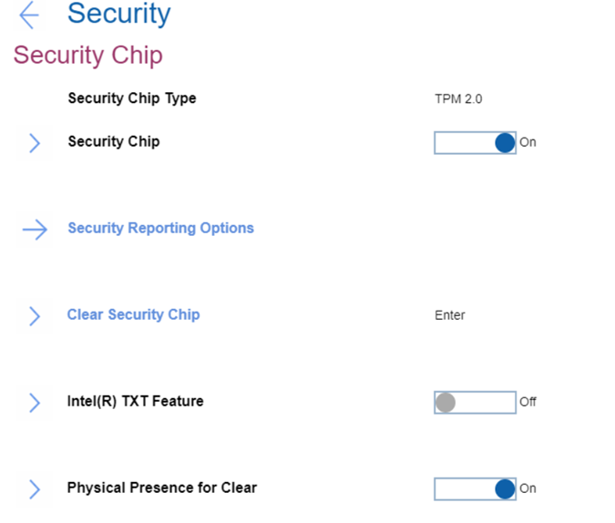
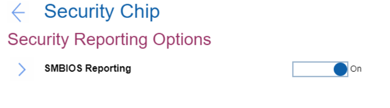

# Security Chip Settings #

## General ##

A TPM chip is a secure crypto-processor that helps you with actions such as generating, storing, and limiting the use of cryptographic keys.

 - [More information at Microsoft.com](https://docs.microsoft.com/en-us/windows-hardware/design/device-experiences/oem-tpm)

### Security Chip Type (display only) ###

Available via [standard Windows commands](https://docs.microsoft.com/en-us/powershell/module/trustedplatformmodule/?view=windowsserver2019-ps&preserve-view=true&viewFallbackFrom=win10-ps)

Security Chip

Options:

1.	**On** - security chip is functional. Default.
2.	Off - security chip is hidden and is not functional.

?> If in `MFG Mode` (manufacturing mode), then TPM (Trusted Platform Module) must be provisioned correctly.

| WMI Setting name | Values | SVP Req'd | AMD/Intel |
|:---|:---|:---|:---|
| SecurityChip | Active, Inactive, Disable, Enable | No | Both |

Clear Security Chip

!> Visible and active only if Security Chip` is `Enabled`.

This option is used to clear encryption keys.

!> It will not be possible to access already encrypted data after these keys are cleared.

?> The option requires additional confirmation for clearing the keys.

Available via standard Windows commands: [Clear-Tpm](https://docs.microsoft.com/en-us/powershell/module/trustedplatformmodule/clear-tpm?view=windowsserver2019-ps) 

Intel(R) TXT Feature

!> Visible and active only if Security Chip` is `Enabled`.

?> Intel (R) Trusted Execution Technology is a hardware-based security foundation to build and maintain a chain of trust, to protect information from software-based attacks.

Options:

1.	On
2.	**Off** – Default.

| WMI Setting name | Values | SVP Req'd | AMD/Intel |
|:---|:---|:---|:---|
| TXTFeature | Disable, Enable | No | Intel |

Physical Presence for Clear

Whether to require confirmation of a user`s physical presence when clearing the security chip.

Options:

1.	**On** - display user confirmation screen when clearing. Default. 
2.	Off - No user confirmation screen when clearing.

| WMI Setting name | Values | SVP Req'd | AMD/Intel |
|:---|:---|:---|:---|
| PhysicalPresenceForTpmClear  | Disable, Enable | Yes | Both |

!> Can only be disabled with Supervisor Password.

## Security Reporting Options ##

Visible and active only if Security Chip` is `Enabled`.  

Open the settings for Security Reporting Options.

SMBIOS Reporting

Whether changes to corresponding UEFI BIOS data are logged in a location (PCR1, defined in the TCG standards) which other authorized programs can monitor, read, and analyze. 

Options:

1.	**On**. Default. 
2.	Off.

