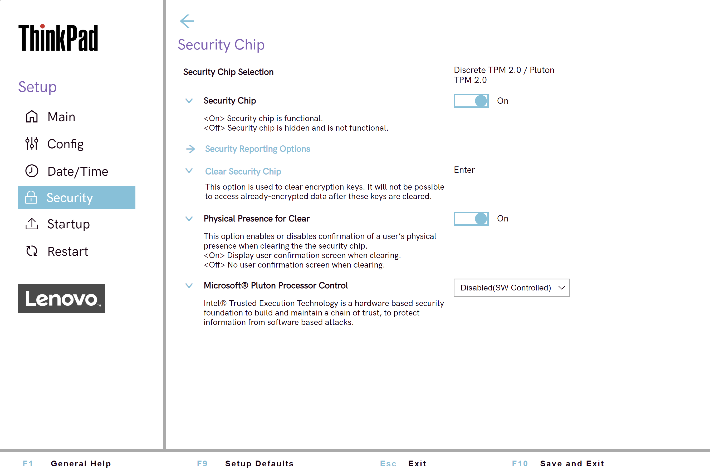

# Security Chip Settings #

### General ###

Security Chip Type

Shows the security chip type.

View-only.

[Available via standard Windows commands](https://docs.microsoft.com/en-us/powershell/module/trustedplatformmodule/?view=windowsserver2019-ps&preserve-view=true&viewFallbackFrom=win10-ps)

Security Chip

Whether to enable security chip functionality.

Possible options:

1.	**On** - Default.
2.	Off - security chip is hidden and is not functional.

?>  If shows `MFG Mode` (manufacturing mode), then TPM (Trusted Platform Module) must be provisioned correctly. If this occurs on a ship-level system, please contact Lenovo Support for assistance.

| WMI Setting name | Values | Locked by SVP | AMD/Intel |
|:---|:---|:---|:---|
| SecurityChip | Active, Inactive, Disable, Enable | Yes | Both |

Clear Security Chip

Visible and active only if Security Chip` is `Enabled`.

This option is used to clear encryption keys.

!>  It will not be possible to access already encrypted data after these keys are cleared.

?> The option requires additional confirmation for clearing the keys.

Available via standard Windows commands: [Clear-Tpm](https://docs.microsoft.com/en-us/powershell/module/trustedplatformmodule/clear-tpm?view=windowsserver2019-ps)

Intel(R) TXT Feature

Visible and active only if Security Chip` is `Enabled`.

?> Intel (R) Trusted Execution Technology is a hardware-based security foundation to build and maintain a chain of trust, to protect information from software-based attacks.

Possible options:

1.	On
2.	**Off** – Default.

| WMI Setting name | Values | Locked by SVP | AMD/Intel |
|:---|:---|:---|:---|
| TXTFeature | Disable, Enable | Yes | Intel |

Physical Presence for Clear

Whether to require confirmation of a user`s physical presence when clearing the security chip.

!>  It is possible to change the value from Enable to Disable only when Supervisor Password exists, because it is required to confirm the action.

Possible options:

1.	**On** - Default.
2.	Off

| WMI Setting name | Values | Locked by SVP | AMD/Intel |
|:---|:---|:---|:---|
| PhysicalPresenceForTpmClear  | Disable, Enable | Yes | Both |

### Security Reporting Options ###

Visible and active only if `Security Chip` is `Enabled`.

Opens settings for Security Reporting Options.

SMBIOS Reporting

Whether to enable reporting of SMBIOS data.

?> Changes to corresponding UEFI BIOS data are logged in a location, (PCR1, defined in the TCG standards), which other authorized programs can monitor, read, and analyze. 

Possible options:

1.	**On** - Default.
2.	Off

