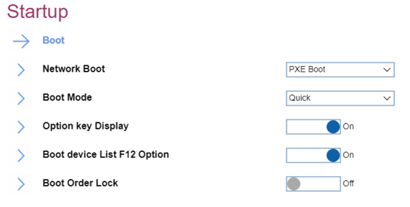
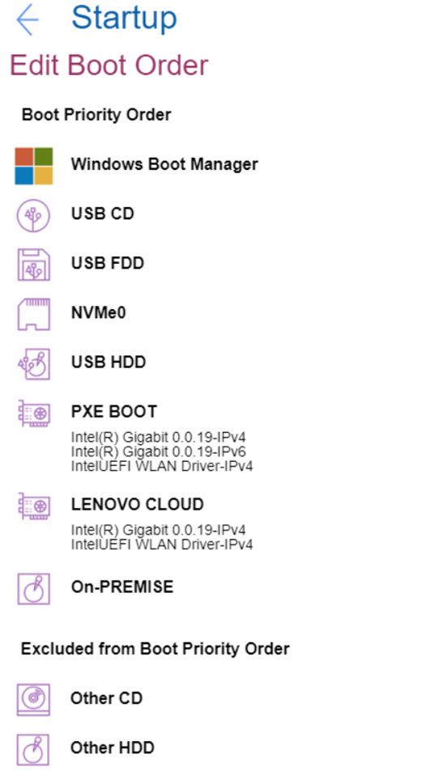

# Startup #
### General ###

Network Boot

Option to select top priority of the Boot Priority Order when waking from LAN.
One of 9 possible options:

1.	**PXE BOTT** – Default
2.	USB CD
3.	USB FDD
4.	NVMe0
5.	USB HDD
6.	LENOVO CLOUD
7.	ON-PREMISE
8.	Other CD
9.	Other HDD

| WMI Setting name | Values |
|:---|:---|
| NetworkBoot | HDD0,HDD1,HDD2,HDD3,HDD4,PXEBOOT,ATAPICD0,ATAPICD1,ATAPICD2,USBFDD,USBCD,USBHDD,OtherHDD,OtherCD,NVMe0,NVMe1,HTTPSBOOT,LENOVOCLOUD,ON-PREMISE,NODEV |

Boot Mode

One of 2 possible values:

1.	**Quick** – the diagnostic splash screen does not display unless you press Esc during boot. Default.
2.	Diagnostics – the diagnostic splash screen always displays during boot.

| WMI Setting name | Values |
|:---|:---|
| BootMode | Quick,Diagnostics |

Option key Display

One of 2 possible states:

1.	**On** – system will show the option key message when the system is booted. Default.
2.	Off – system will not show the option key message. 

| WMI Setting name | Values |
|:---|:---|
| StartupOptionKeys | Disable,Enable |

Boot device List F12 Option

One of 2 possible states:

1.	**On** – F12 key is used to invoke a pop-up Boot devise list. Default. 
    **Note**. This option is only available when Supervisor enters setup.
2.	Off – F12 does not invoke a pop-up Boot device list.

| WMI Setting name | Values |
|:---|:---|
| BootDeviceListF12Option | Disable,Enable |

Boot Order Lock

One of 2 possible states:

1.	On – Boot Priority Order is locked.
2.	**Off** – Boot Priority Order is not locked. Default. 

| WMI Setting name | Values |
|:---|:---|
| BootOrderLock | Disable,Enable |

### Boot ###

Boot Priority Order

The ordered list of currently defined boot priority order.
Keys used to view or configure devices: 

* '↑' and '↓' arrows Select a device. 
* '+' and '-' move the device up or down. 
* 'Shift + 1' enables or disables a device. 
* 'Delete' deletes an unprotected device.

Possible items on the list:

1.	Windows Boot Manager
2.	USB CD
3.	USB FDD
4.	NVMe0
5.	USB HDD
6.	PXE Boot – sub-menu appears only when multiple network stacks are available. 
    a.	Intel (R) Gigabit x.x.xx-Ipv4 
    b.	Intel (R) Gigabit x.x.xx-Ipv6 
7.	LENOVO CLOUD
8.	ON-PREMISE

| WMI Setting name | Values |
|:---|:---|
| BootOrder | HDD0,HDD1,HDD2,HDD3,HDD4,PXEBOOT,ATAPICD0,ATAPICD1,ATAPICD2,USBFDD,USBCD,USBHDD,OtherHDD,OtherCD,NVMe0,NVMe1,HTTPSBOOT,LENOVOCLOUD,ON-PREMISE,NODEV |

Excluded from boot priority order

By default, the following items are excluded from boot priority order:

1.	Other CD
2.	Other HDD

| WMI Setting name | Values |
|:---|:---|
| Not available via WMI. If needed, you can get the list of possible values and compare them with the current settings. |  |

