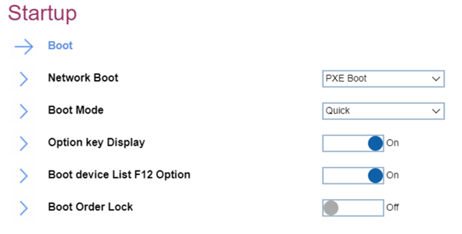
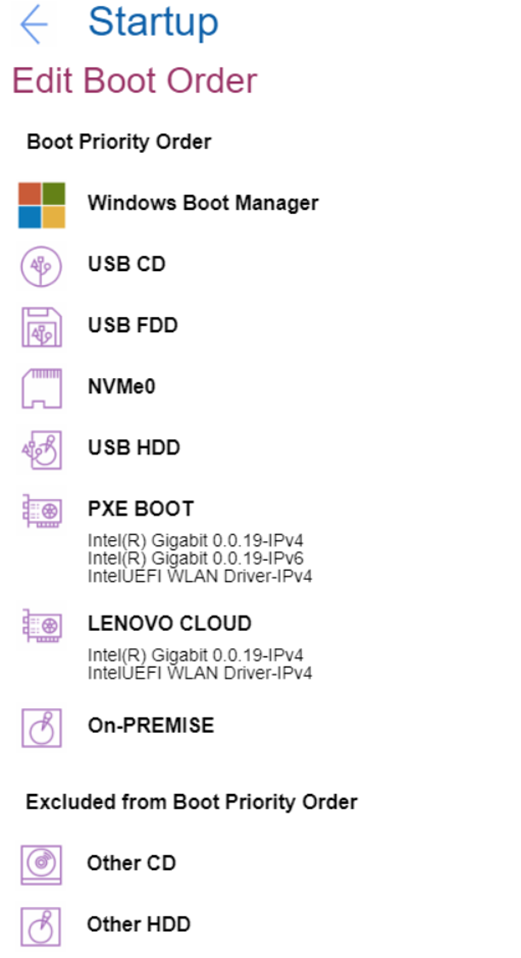

# Startup #
### General ###

Network Boot

Select top priority of the Boot Priority Order when waking from LAN.

Options:

1.	**PXE BOOT** – Default
2.	USB CD
3.	USB FDD
4.	NVMe0
5.	USB HDD
6.	LENOVO CLOUD
7.	ON-PREMISE
8.	Other CD
9.	Other HDD

!> LENOVO CLOUD and ON-PREMISE may not be available on all models.

| WMI Setting name | Values | SVP Req'd | AMD/Intel |
|:---|:---|:---|:---|
| NetworkBoot | HDD0, HDD1, HDD2, HDD3, HDD4,  PXEBOOT, ATAPICD0, ATAPICD1, ATAPICD2, USBFDD,  USBCD, USBHDD, OtherHDD, OtherCD, NVMe0,  NVMe1, HTTPSBOOT, LENOVOCLOUD, ON-PREMISE, NODEV | No | Both |

Boot Mode

Options:

1.	**Quick** – the diagnostic splash screen does not display unless you press `Esc` during boot. Default.
2.	Diagnostics – the diagnostic splash screen always displays during boot.

| WMI Setting name | Values | SVP Req'd | AMD/Intel |
|:---|:---|:---|:---|
| BootMode | Quick, Diagnostics | No | Both |

Option key Display

Options:

1.	**On** – system will show the option key message when the system is booted. Default.
2.	Off – system will not show the option key message. 

| WMI Setting name | Values | SVP Req'd | AMD/Intel |
|:---|:---|:---|:---|
| StartupOptionKeys | Disable, Enable | No | Both |

Boot device List F12 Option

Options:

1.	**On** – `F12` key is used to invoke a pop-up Boot devise list. Default. 
2.	Off – `F12` does not invoke a pop-up Boot device list.

?> This option is only available when Supervisor enters setup.

| WMI Setting name | Values | SVP Req'd | AMD/Intel |
|:---|:---|:---|:---|
| BootDeviceListF12Option | Disable, Enable | Yes | Both |

Boot Order Lock

Options:

1.	On – Boot Priority Order is locked.
2.	**Off** – Boot Priority Order is not locked. Default. 

| WMI Setting name | Values | SVP Req'd | AMD/Intel |
|:---|:---|:---|:---|
| BootOrderLock | Disable, Enable | No | Both |

### Boot ###

Boot Priority Order

The ordered list of currently defined boot priority order.

Keys used to view or configure devices: 

* `↑` and `↓` arrows Select a device. 
* `+` and `-` move the device up or down. 
* `Shift` + `1` enables or disables a device. 
* `Delete` deletes an unprotected device.

Possible items on the list:

1.	Windows Boot Manager
2.	USB CD
3.	USB FDD
4.	NVMe0
5.	USB HDD
6.	PXE Boot – sub-menu appears only when multiple network stacks are available. 
    a.	Intel (R) Gigabit x.x.xx-Ipv4 
    b.	Intel (R) Gigabit x.x.xx-Ipv6 
7.	LENOVO CLOUD
8.	ON-PREMISE

!> LENOVO CLOUD and ON-PREMISE may not be available on all models.

| WMI Setting name | Values | SVP Req'd | AMD/Intel |
|:---|:---|:---|:---|
| BootOrder | HDD0, HDD1, HDD2, HDD3, HDD4,  PXEBOOT, ATAPICD0, ATAPICD1, ATAPICD2, USBFDD,  USBCD, USBHDD, OtherHDD, OtherCD, NVMe0, NVMe1, HTTPSBOOT, LENOVOCLOUD, ON-PREMISE, NODEV | No | Both |

Excluded from boot priority order

By default, the following items are excluded from boot priority order:

1.	Other CD
2.	Other HDD

