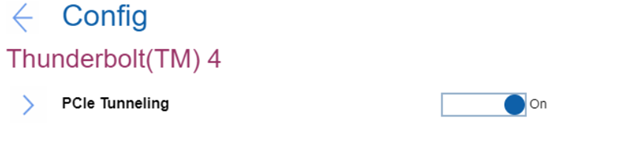

# Thunderbolt(TM) 4 Settings #

PCIe Tunneling

One of 2 possible states for PCIe (peripheral component interconnect express) Tunneling:

1.	**On** - PCIe tunneling is enabled. Default.
2.	Off - PCIe tunneling is disabled.

    ?>  Some Thunderbolt devices, such as external GPUs and storage drives, may not work properly.

The USB functions of USB4 based devices that are Thunderbolt 4 certified may still work.

| WMI Setting name | Values | Locked by SVP | AMD/Intel |
|:---|:---|:---|:---|
| PCIeTunneling | Disable, Enable | Yes | Both |

