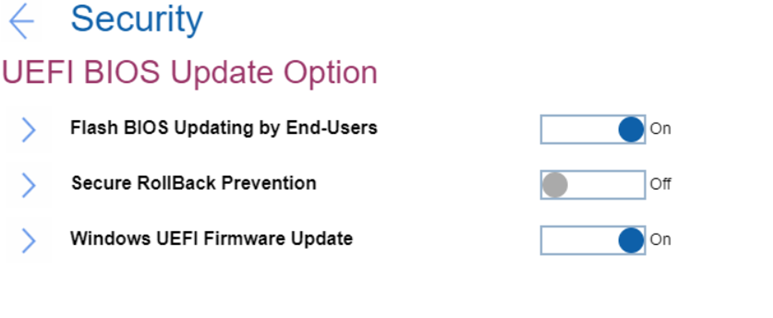

# UEFI BIOS Update Option Settings #

Flash BIOS Updating by End-Users

One of 2 possible states:

1.	Off - entering supervisor password is required to update UEFI BIOS when Supervisor password is installed. 
2.	**On** – UEFI BIOS can be updated without entering supervisor password. Default. 

| WMI Setting name | Values |
|:---|:---|
| BIOSUpdateByEndUsers |  |

Secure RollBack Prevention

One of 2 possible states:

1.	Off – allow flashing to older version of UEFI BIOS. Default, if ‘OS Optimized Defaults’ has value ‘Off’.
2.	On – prevent flashing to older version of UEFI BIOS. Default, if ‘OS Optimized Defaults’ has value ‘On’.

| WMI Setting name | Values |
|:---|:---|
| SecureRollBackPrevention |  |

Windows UEFI Firmware Update

One of 2 possible options:

1.	**On** – allow Windows UEFI Firmware Update. Default.
2.	Off – BIOS will skip Windows UEFI Firmware Update.

| WMI Setting name | Values |
|:---|:---|
| WindowsUEFIFirmwareUpdate |  |

