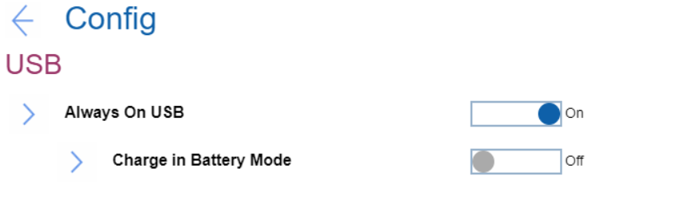

# USB Settings #

Always on USB

The USG ports can charge external device during low power states (standby, hibernate or power-off).
Note. If the system runs on battery mode, this works only in standby mode.
One of 2 possible states:

1.	**On** - the USB ports are powered during low power states. Default.
2.	Off - USB ports are disabled during low power states.

| WMI Setting name | Values | Locked by SVP | AMD/Intel |
|:---|:---|:---|:---|
| AlwaysOnUSB | Disable, Enable | No | Both |

Charge in Battery Mode

Visible only if 'Always on USB' is Enabled.
One of 2 possible states:

1.	On - Enables charging when system is in hibernate or power-off state and in battery mode.
2.	**Off** - Disables charging when system is in hibernate or power-off state and in battery mode. Default.

| WMI Setting name | Values | Locked by SVP | AMD/Intel |
|:---|:---|:---|:---|
| ChargeInBatteryMode | Disable, Enable | No | Both |

