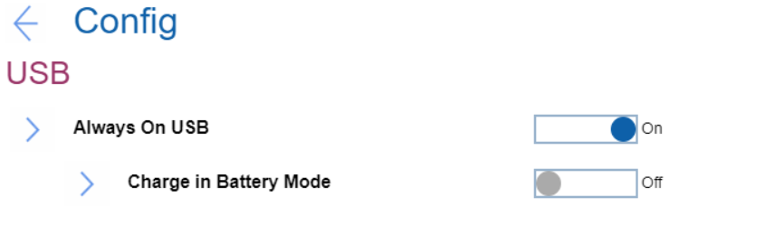

# USB Settings #

Always on USB

Whether the USB ports can charge external device during low power states (standby, hibernate or power-off). 

!> If the system runs on battery mode, this works only in standby mode.

Options:

1.	**On** - Default. 
2.	Off.

| WMI Setting name | Values | SVP Req'd | AMD/Intel |
|:---|:---|:---|:---|
| AlwaysOnUSB | Disable, Enable | No | Both |

Charge in Battery Mode

Whether to charge when system is in hibernate or power-off state and in battery mode.

!> Visible only if 'Always on USB' is Enabled.

Options:

1.	On.
2.	**Off** - Default.

| WMI Setting name | Values | SVP Req'd | AMD/Intel |
|:---|:---|:---|:---|
| ChargeInBatteryMode | Disable, Enable | No | Both |

