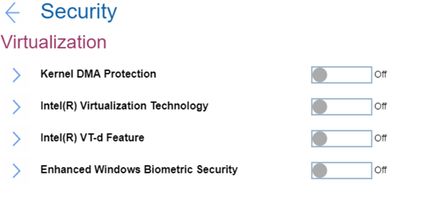

# Virtualization Settings #

Kernel DMA Protection

Kernel DMA protection to prevent drive-by Direct Memory Access (DMA) attacks using PCI hot plug devices connected to system.
One of 2 Possible options:

1.	Off – Kernel DMA protection is off. Default, if ‘OS Optimized Defaults’ has value ‘Off’.
2.	On – Kernel DMA protection is on. Option will require additional confirmation and will automatically enable Intel (R) Virtualization Technology and Intel (R) VT-d Feature. Default, if ‘OS Optimized Defaults’ has value ‘On’.

Requires additional confirmation of changing these settings.

| WMI Setting name | Values | Locked by SVP | AMD/Intel |
|:---|:---|:---|:---|
| KernelDMAProtection | Disable, Enable | Yes | Both |

Intel (R) Virtualization Technology \ AMD-V

**Intel-based machine**

One of 2 Possible options:

1.	On – a VMM (Virtual Machine Monitor) can utilize the additional hardware capabilities provided by Intel (R) Virtualization technology. Default, if ‘OS Optimized Defaults’ has value ‘On’. 
2.	Off - Intel (R) Virtualization Technology is off. Default, if ‘OS Optimized Defaults’ has value ‘Off’.

?>  It is automatically enabled and cannot be disabled if ‘Kernel DMA Protection’ is enabled.

Additional information is here: [How to enable Virtualization Technology on Lenovo PC computers](https://support.lenovo.com/de/en/solutions/ht500006).

| WMI Setting name | Values | Locked by SVP | AMD/Intel |
|:---|:---|:---|:---|
| VirtualizationTechnology | Disable, Enable | Yes | Intel |

**AMD-based machine**

One of 2 Possible options:

1. **On** - VMM (Virtual Machine Monitor) can utilize the additional hardware capabilities provided by AMD-V (AMD Virtualization). Default. 
2. Off - AMD-V is turned off.

?>  The setting becomes enabled automatically when "Device Guard" is set to "On".

| WMI Setting name | Values | Locked by SVP | AMD/Intel |
|:---|:---|:---|:---|
| AmdVt | Disable, Enable | Yes | AMD |

Intel (R) VT-d Feature

One of 2 Possible options:

1.	On – Intel (R) VT-d Feature is Intel (R) Virtualization Technology for Directed I/O. Default, if ‘OS Optimized Defaults’ has value ‘On’. 
2.	Off - Intel (R) VT-d Feature is off. Default, if ‘OS Optimized Defaults’ has value ‘Off’.

?>  It is automatically enabled and cannot be disabled if ‘Kernel DMA Protection’ is enabled.

More information on the [official Intel site](https://software.intel.com/content/www/us/en/develop/articles/intel-virtualization-technology-for-directed-io-vt-d-enhancing-intel-platforms-for-efficient-virtualization-of-io-devices.html).

| WMI Setting name | Values | Locked by SVP | AMD/Intel |
|:---|:---|:---|:---|
| VTdFeature | Disable, Enable | Yes | Intel |

Enhanced Windows Biometric Security

One of 2 Possible options:

1.	On - allows use of ‘Enhanced sign-in security’ for fingerprint and face authentication with Windows Hello.
2.	**Off** – does not allow Windows to use ‘Enhanced sign-in security’ for biometrics. Default.  

?>  This option is recommended for Windows 10 October 2018 Update and for Windows 10 version 2004 and earlier, which do not support this feature.

| WMI Setting name | Values | Locked by SVP | AMD/Intel |
|:---|:---|:---|:---|
| EnhancedWindowsBiometricSecurity | Disable, Enable | Yes | Both |

