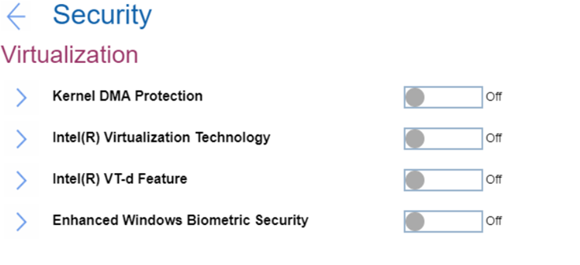

# Virtualization Settings #

Kernel DMA Protection

Kernel DMA Protection prevents drive-by Direct Memory Access (DMA) attacks using PCI hot plug devices connected to system. 

Options:

1.	Off – Kernel DMA protection is off. Default, if `OS Optimized Defaults` has value `Off`.
2.	On – Kernel DMA protection is on. Option will require additional confirmation and will automatically enable Intel (R) Virtualization Technology and Intel (R) VT-d Feature. Default, if `OS Optimized Defaults` has value `On`.

Requires additional confirmation of changing these settings.

| WMI Setting name | Values | SVP Req'd | AMD/Intel |
|:---|:---|:---|:---|
| KernelDMAProtection | Disable, Enable | No | Intel |

Intel (R) Virtualization Technology \ AMD-V

**Intel-based machine** 

Options:

1.	On – a VMM (Virtual Machine Monitor) can utilize the additional hardware capabilities provided by Intel (R) Virtualization technology. Default, if `OS Optimized Defaults` has value `On`. 
2.	Off - Intel (R) Virtualization Technology is off. Default, if `OS Optimized Defaults` has value `Off`.

!> If `Kernel DMA Protection` is enabled, this feature is automatically enabled and cannot be disabled.

Additional information is here: [How to enable Virtualization Technology on Lenovo PC computers](https://support.lenovo.com/de/en/solutions/ht500006).

| WMI Setting name | Values | SVP Req'd | AMD/Intel |
|:---|:---|:---|:---|
| VirtualizationTechnology | Disable, Enable | No | Intel |

**AMD-based machine**

Options:

1. **On** - VMM (Virtual Machine Monitor) can utilize the additional hardware capabilities provided by AMD-V (AMD Virtualization). Default. 
2. Off - AMD-V is turned off. 

?> The setting is automatically enabled when `Device Guard` is set to `On`.

| WMI Setting name | Values | SVP Req'd | AMD/Intel |
|:---|:---|:---|:---|
| AmdVt | Disable, Enable | No | AMD |

Intel (R) VT-d Feature

Options:

1.	On – Intel (R) VT-d Feature is Intel (R) Virtualization Technology for Directed I/O. Default, if `OS Optimized Defaults` has value `On`. 
2.	Off - Intel (R) VT-d Feature is off. Default, if `OS Optimized Defaults` has value `Off`.

!> Automatically enabled, and cannot be disabled if `Kernel DMA Protection` is enabled.

More information on the [official Intel site](https://software.intel.com/content/www/us/en/develop/articles/intel-virtualization-technology-for-directed-io-vt-d-enhancing-intel-platforms-for-efficient-virtualization-of-io-devices.html).

| WMI Setting name | Values | SVP Req'd | AMD/Intel |
|:---|:---|:---|:---|
| VTdFeature | Disable, Enable | No | Intel |

Enhanced Windows Biometric Security

Options:

1.	On - allows use of `Enhanced sign-in security` for fingerprint and face authentication with Windows Hello. 
2.	**Off** – does not allow Windows to use `Enhanced sign-in security` for biometrics. Default.

!> Set to `Off` for Windows 10 October 2018 Update and for Windows 10 version 2004 and earlier, which do not support this feature.

| WMI Setting name | Values | SVP Req'd | AMD/Intel |
|:---|:---|:---|:---|
| EnhancedWindowsBiometricSecurity | Disable, Enable | No | Both |

