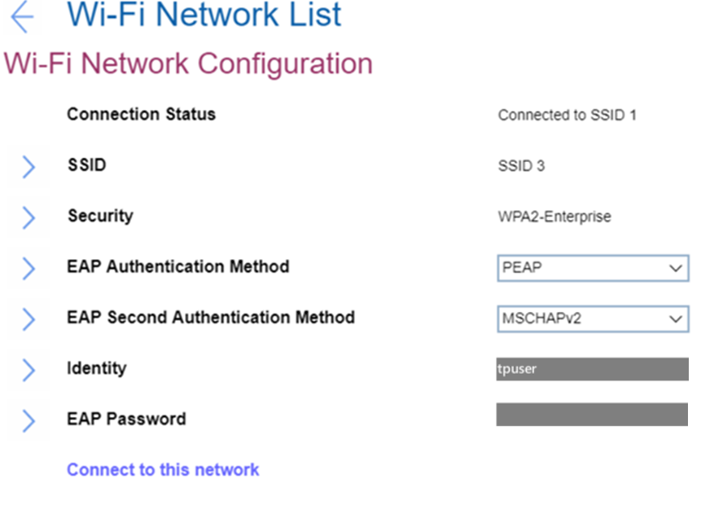

## WiFi Network Configuration ##

### Connection Status (display only) ###

Whether device is connected to this Wi-Fi network.

 Possible values:

1.	**Disconnected** - Default.
2.	Connected.

### SSID (display only) ###

SSID (Service Set Identifier) is the name of the wireless network. 

### Security (display only) ###

Security type of this Wi-Fi network. Possible values:

1.	Open
2.	WPA2-Personal
3.	WPA2-Enterprise
4. PEAP
5. EAP-TLS

### Password ###

Enter the WiFi password. 

!> Visible only for networks with security WPA2-Personal. 

?> Password length: 8-63 characters.

### EAP Authentication Method (display only) ###

Selected EAP Authentication Method.

!> Visible only for networks with security WPA2-Enterprise. Default value depends on the network.

Possible values:

1. PEAP
2.	EAP-TLS 

### EAP Second Authentication Method (display only) ###

Selected EAP Second Authentication Method.

!> Visible only for networks with security WPA2-Enterprise and if `EAP Authentication Method` is `PEAP`. Default value depends on the network.

Possible values:

1. MSCHAPv2

### Enroll CA Cert ###

Enroll a CA (Certification Authority) certificate.

Empty by default.

!> Visible only for networks with security WPA2-Enterprise.

### Enroll Client Cert ###

Enroll a client certificate.

Empty by default.

!> Visible only for networks with security WPA2-Enterprise and if `EAP Authentication Method` is `EAP-TLS`.

### Enroll Client Private Key ###

This is the option to enroll client private key. Empty by default.

!> Visible only for networks with security WPA2-Enterprise and if `EAP Authentication Method` is `EAP-TLS`.

### Identity (display only) ###

Identity value if there is any. Identity length: 6-20 characters.

!> Visible only for networks with security WPA2-Enterprise.

### EAP Password ###

Enter the EAP password. Requirements to password length: 1-63 characters.

!> Visible only for networks with security WPA2-Enterprise.

### {Connection Action} ###

Possible actions:

1.	Connect to this network - visible if device is not connected to this Wi-Fi network
2.	Disconnect - visible if device is connected to this Wi-Fi network