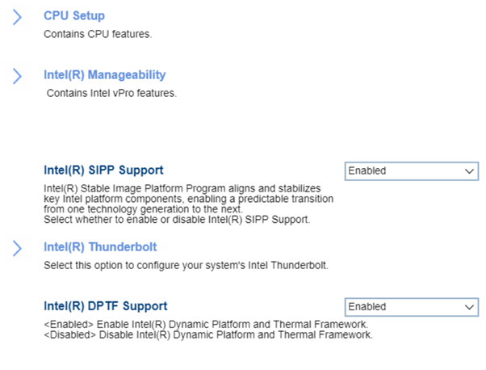

# Advanced #

Intel(R) SIPP Support

Options:

1. **Enabled** – Default.
2. Disabled.

?> Intel(R) Stable Image Platform Program (SIPP) aligns and stabilizes key Intel platform components, enabling a predictable transition from one technology generation to the next. 

| WMI Setting name | Values | SVP Req'd | AMD/Intel |
|:---|:---|:---|:---|
|  |  |  | Both |

Intel(R) DPTF Support

Intel(R) Dynamic Platform and Thermal Framework (DPTF) is a software that helps managing power to the CPU vs temperature. Keeping CPU temperature down while still delivering good performance. 
Options:

1. **Enabled** – Intel(R) DRTF is turned on. Default.
2. Disabled - Intel(R) DRTF is turned off.

**Note**. This feature is optional, so may not be available on all models.

| WMI Setting name | Values | SVP Req'd | AMD/Intel |
|:---|:---|:---|:---|
|  |  |  | Both |

