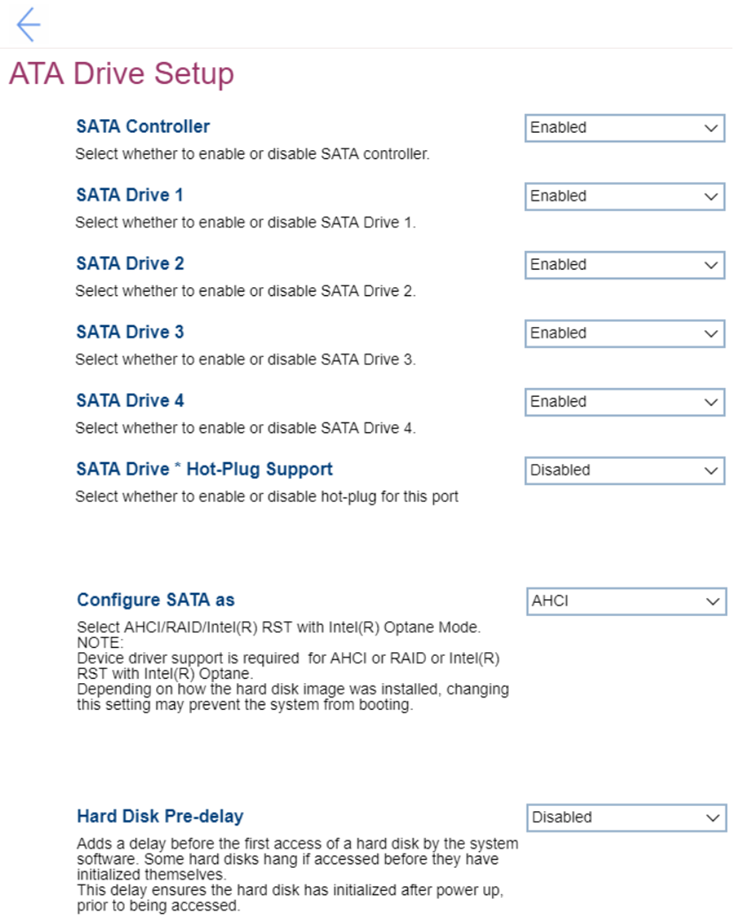

# ATA Drive Setup Settings #

SATA Controller

One of 2 possible states for the SATA controller:

1. **Enabled** – SATA controller is enabled. Default.
2. Disabled – SATA controller is disabled. When selected, then following settings become unavailable: 
    a. SATA Drive from 1 to 5  
    b. SATA Drive * Hot-Plug Support  
    c. Configure SATA as  

| WMI Setting name | Values | SVP Req'd | AMD/Intel |
|:---|:---|:---|:---|
|  |  |  | Both |

SATA Drive [N]

[N] is the order number of a SATA Drive. 
One of 2 possible states for each SATA Drive:

1. **Enabled** – the corresponding SATA Drive is enabled. Default. 
2. Disabled – the corresponding SATA Drive is disabled.

**Note**. The fields are unavailable, if “SATA Controller” is set to “Disabled”.

| WMI Setting name | Values | SVP Req'd | AMD/Intel |
|:---|:---|:---|:---|
|  |  |  | Both |

SATA Drive * Hot-Plug Support

One of 2 possible states for the hot-plug port:

1. Enabled – the hot-plug port is enabled. 
2. **Disabled** – the hot-plug port is disabled. Default.

**Note**. The field is unavailable, if “SATA Controller” is set to “Disabled”.

| WMI Setting name | Values | SVP Req'd | AMD/Intel |
|:---|:---|:---|:---|
|  |  |  | Both |

Configure SATA as

One of 3 possible options for SATA configuration mode:

1. **ANCI** – Default. When selecting, it requires additional confirmation.  
    **Note**. If you change the SATA mode to ANCI you may not boot the system due to the failure of Intel(R) RST with Intel(R) Optane (RAID) function. 
2. Intel(R) RST with Intel(R) Optane
3. RAID – When selecting, it requires additional confirmation.  
    **Note**. Please do not disable SATA drives in RAID mode. Otherwise you may not boot the system due to the failure of RAID function.

**Note**. Device driver support is required for ANCI or RAID or Intel(R) RST with Intel(R) Optane. 
Depending on how the hard disk image was installed, changing the setting may prevent the system from booting.

| WMI Setting name | Values | SVP Req'd | AMD/Intel |
|:---|:---|:---|:---|
|  |  |  | Both |

Hard Disk Pre-delay

Setting to add a delay before the first access of a hard disk by the system software. Some hard disks hand if accessed before they have initialized themselves. This delay ensures the hard disk has initialized after power up, prior to being accessed. 
One of 8 possible options:

1. **Disabled** – Default.
2. 3 Seconds
3. 6 Seconds
4. 9 Seconds
5. 12 Seconds
6. 15 Seconds
7. 21 Seconds
8. 30 Seconds

| WMI Setting name | Values | SVP Req'd | AMD/Intel |
|:---|:---|:---|:---|
|  |  |  | Both |

