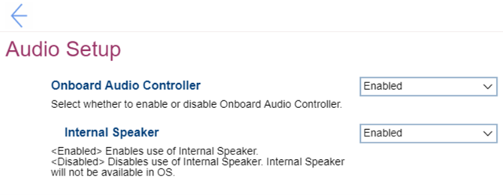

# Audio Setup Settings #

Onboard Audio Controller

Enable or disable onboard audio controller.

Options:

1. **Enabled**. Default. 
2. Disabled.

!> If set to `Disabled`, the `Internal Speaker` setting will be unavailable.

| WMI Setting name | Values | SVP / SMP Req'd | AMD/Intel |
|:---|:---|:---|:---|
| OnboardAudioController | Disabled, Enabled | yes | Intel |

Internal Speaker

Whether the internal speaker is available in the OS.

Options:

1. **Enabled** - Default. 
2. Disabled 

?> Unavailable if `Onboarding Audio Controller` is set to `Disabled`.

| WMI Setting name | Values | SVP / SMP Req'd | AMD/Intel |
|:---|:---|:---|:---|
| InternalSpeaker | Disabled, Enabled | yes | Intel |

