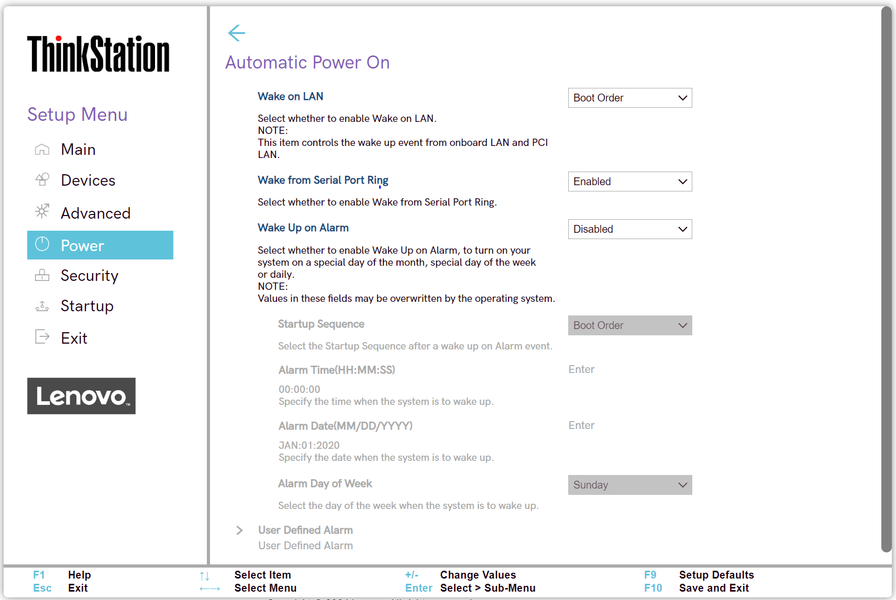

# Automatic Power On Settings #

### General ###

Wake on LAN

Wake on LAN (Local Area Network).

Options:

1. **Enabled** - Default.
2. Disabled.

?> Controls the wake up event from onboard LAN (Local Area Network) and PCI (Peripheral Component Interconnect) LAN.

| WMI Setting name | Values | SVP / SMP Req'd | AMD/Intel |
|:---|:---|:---|:---|
| WakeonLAN |  | yes | Both |

Wake from Serial Port Ring

Options:

1. **Enabled** – Default. 
2. Disabled

| WMI Setting name | Values | SVP / SMP Req'd | AMD/Intel |
|:---|:---|:---|:---|
| WakefromSerialPortRing |  | yes | Both |

Wake Up on Alarm 

Whether to turn on your system
 - one time,
 - repeating on a specific day of the month, or week, or 
 - daily

Options:

1. **Disabled** - the system will not turn on automatically. Default. 
2. Single Event - turn on one-time on the specified day and time. 
3. Daily Event - turn on every day at the specified time.
4. Weekly Event - turn on every week on the specified day and time.
5. User Defined - enables `User Defined Alarm` group of settings. 

!> Values in these fields may be overwritten by the operating system. 

| WMI Setting name | Values | SVP / SMP Req'd | AMD/Intel |
|:---|:---|:---|:---|
| WakeUponAlarm |  | yes | Both |

Alarm Time ( HH : MM : SS)

Select the exact time for the system to turn on.

Active when `Wake Up on Alarm` has one of the values:

* Single Event
* Daily Event
* Weekly Event

Options:

1.	**00 : 00 : 00** – Default
2.	HH : MM : SS 
    a. HH - Hour:  00 ~ 23 
    b. MM - Minute:  00 ~ 59 
    c. SS - Second:  00 ~ 59 

| WMI Setting name | Values | SVP / SMP Req'd | AMD/Intel |
|:---|:---|:---|:---|
| AlarmTime |  | yes | Both |

Alarm Date (MM/DD/YYYY) 

Select the exact calendar date for the system to turn on.

Active only when `Wake Up on Alarm` has value `Single Event`.  

Options:

1.	**01/01/YYYY** – Default.
2.	MM/DD/YYYY: 
    a. MM – Months: January to December  
    b. DD – Date: 1 ~ 31  
    c. YYYY – Year: 1980 ~ 2099  

| WMI Setting name | Values | SVP / SMP Req'd | AMD/Intel |
|:---|:---|:---|:---|
| AlarmDate |  |  | Both |

Alarm Day of Week

Select the exact week day for the system to turn on.  

?> Active only when `Wake Up on Alarm` has value `Weekly Event`.

Options:

1. **Sunday** – Default
2. Monday
3. Tuesday
4. Wednesday
5. Thursday
6. Friday
7. Saturday

| WMI Setting name | Values | SVP / SMP Req'd | AMD/Intel |
|:---|:---|:---|:---|
| AlarmDayofWeek |  | yes | Both |

### User Defined Alarm ###

Settings per {Weekday}.

{Weekday}

Whether the system will turn on automatically on this day of the week.

1. **Off** - the system will not turn on automatically on this day of the week. Default.
2. On – the system will turn on automatically on this day of the week.

| WMI Setting name | Values | SVP / SMP Req'd | AMD/Intel |
   |:---|:---|:---|:---|
| UserDefinedAlarmSunday  |   | yes | Both |

?> The WMI setting name shown here is for Sunday. For other week days, change `Sunday` to the desired day of the week.

### User Defined Alarm Time (HH : MM : SS) ###

Specify the time when the system is to wake up.

| WMI Setting name | Values | SVP or SMP Req'd |
|:---|:---|:---|
| UserDefinedAlarmTime |  | yes |
