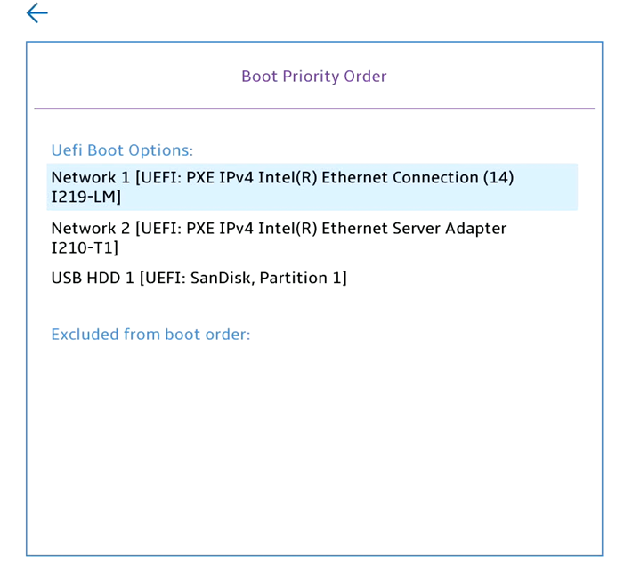

# Boot Priority Order #

UEFI Boot Options

The ordered list of currently defined boot priority order. 

* User Up and Down arrows to select a device.
* ' + '  and ' - ' move the device up or down. 
* ' x ' excludes/includes the device to boot.

Possible items on the list depends on the machine configuration. For every item on the list system shows:
[Device Type] [Device Model Number].

| WMI Setting name | Values | SVP Req'd | AMD/Intel |
|:---|:---|:---|:---|
|  |  |  | Both |

Excluded from boot priority order

Shows the items which are excluded from boot priority order.  
Can be empty, if there are no excluded items.

| WMI Setting name | Values | SVP Req'd | AMD/Intel |
|:---|:---|:---|:---|
|  |  |  | Both |

