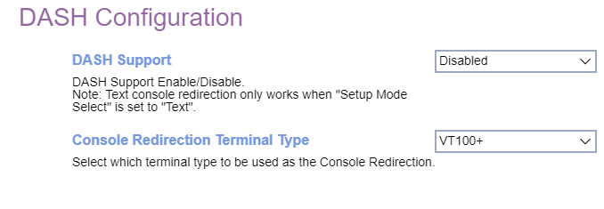

# DASH Configuration #

DASH Support

Options:

1.  **Disabled** - Default.
2.  Enabled.

| WMI Setting name | Values | SVP or SMP Req'd | AMD/Intel |
|:---|:---|:---|:---|
| DASHSupport | Disable, Enable | yes | AMD |

Console Redirection Terminal Type

?> The following emulation types are available.   ANSI: Extended ASCII char set.   VT100: ASCII char set.   VT100+: Extends VT100 to support color, function keys, etc.   VT-UTF8: Uses UTF8 encoding to map Unicode chars onto 1 or more bytes.  

Options:

1. VT100
1. VT100+
1. VT-UTF8
1. ANSI

<!-- | WMI Setting name | Values | SVP or SMP Req'd | AMD/Intel |
|:---|:---|:---|:---|
| ConsoleRedirection | setting_values | yes_no | both | -->

