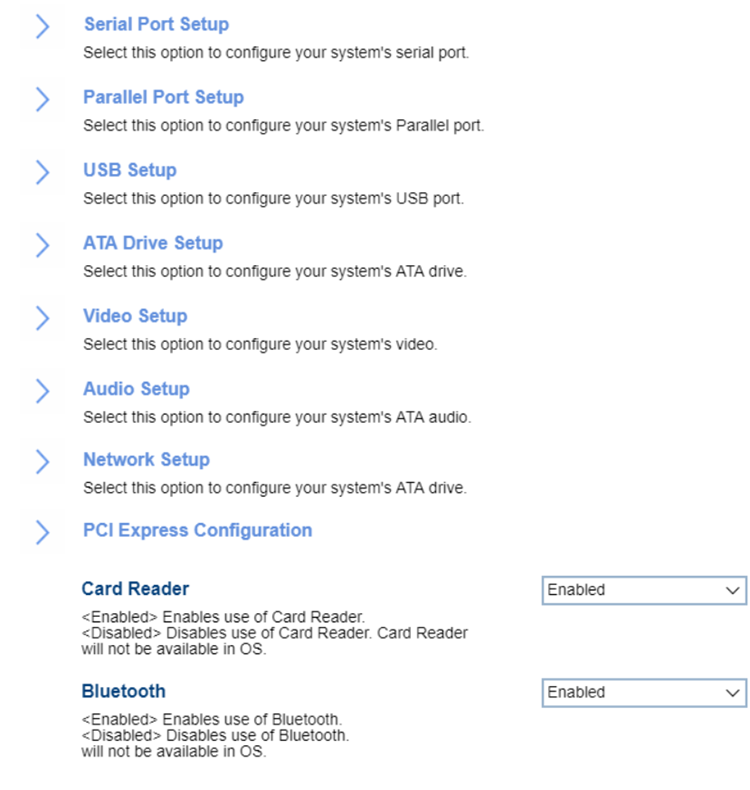

# Devices #

Card Reader

Whether Card Reader will be available in OS.

Options:

1.	**Enabled** - Default.
2.	Disabled 

| WMI Setting name | Values | SVP Req'd | AMD/Intel |
|:---|:---|:---|:---|
|  |  |  | Both |

Bluetooth

Whether Bluetooth will be available in OS.

Options:

1.	**Enabled** - Default.
2.	Disabled  

| WMI Setting name | Values | SVP Req'd | AMD/Intel |
|:---|:---|:---|:---|
|  |  |  | Both |

