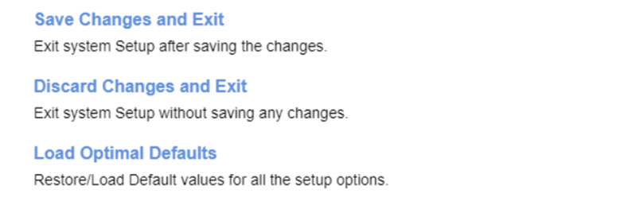

# Exit Settings #

Save Changes and Exit

Exit system Setup after saving the changes.

The action will require additional confirmation.

Discard Changes and Exit

Exit system Setup without saving any changes.

The action will require additional confirmation.

Load Optimal Defaults

Restore/Load Default values for all the setup options.

The action will require additional confirmation.

