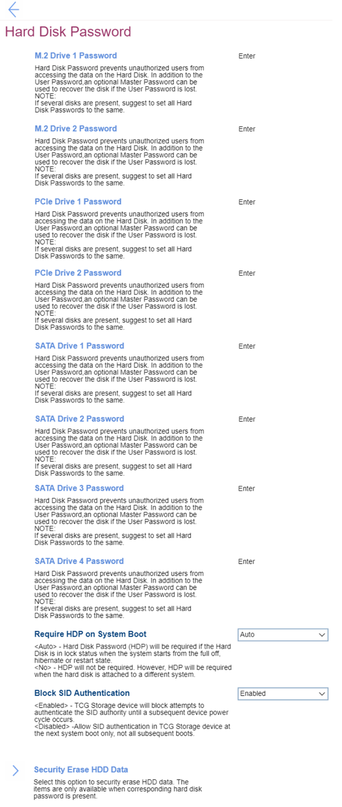
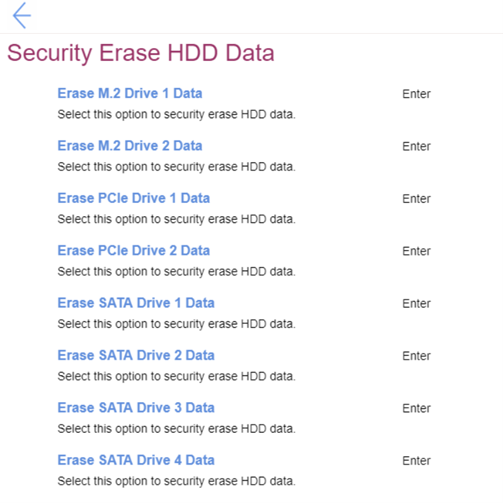

# Hard Disk Password Settings #
### General ###

 [ DriveType ] [ N ] Password

[ DriveType ] stands for the drive type. 
[ N ] stands for the order number of a drive.

Hard Disk Password (HDP) prevents unauthorized users from accessing the data on the Hard Disk. In addition to the User password and optional Master Password can be used to recover the disk if the User Password is lost.

For each drive it is possible to define a separate password, or keep a drive without a password.  
One of 2 states for every drive:

1. Enabled – HDP (single of dual) is installed.
2. **Disabled** – HDP is not installed. Default.

For enabling the password system will request additional choice of the password type:
1. **Single Password** - when a single HDP is set, the user must enter the user password to access files and applications on the storage drive. Default.
2. Dual Password (User+Admin) - The admin HDP is set and used by a system administrator. It enables the administrator to access any storage drive in a system or any computer connected in the same network. The administrator can also assign a user HDP for each computer in the network. The user of the computer can change the user HDP as desired, but only the administrator can remove the user HDP. 

While enabling the following parameters are available:  <!-- TBD which parameters are requested during adding\editing the password.  -->
1. [Enter New Password]
2. [Confirm New Password]
3. Show Password – [On\Off] statuses
4. < Actions >:  
    a. **Save** – default 
    b. Cancel

**Note**. If several disks are present, it’s suggested to set all Hard Disk Passwords to the same. 

| WMI Setting name | Values | SVP Req'd | AMD/Intel |
|:---|:---|:---|:---|
|  |  |  | Both |

Require HDP on System Boot

One of 2 states:

1. **Auto** – HDP will be required if the Hard Disk is in lock status when the system starts from the full off, hibernate or restart state. Default.
2. No – HDP will not be required. However, HDP will be required when the hard disk is attached to a different system.

| WMI Setting name | Values | SVP Req'd | AMD/Intel |
|:---|:---|:---|:---|
|  |  |  | Both |

Block SID Authentication

One of 2 states:

1. **Enabled** – TCG (Trusted Computing Group) Storage device will block attempts to authenticate the SID (Security Identifier) authority until a subsequent device power cycle occurs. Default. 
2. Disabled – Allow SID authentication in TCG Storage device at the next boot only, not all subsequent boots.

| WMI Setting name | Values | SVP Req'd | AMD/Intel |
|:---|:---|:---|:---|
|  |  |  | Both |

### Security Erase HDD Data ###
