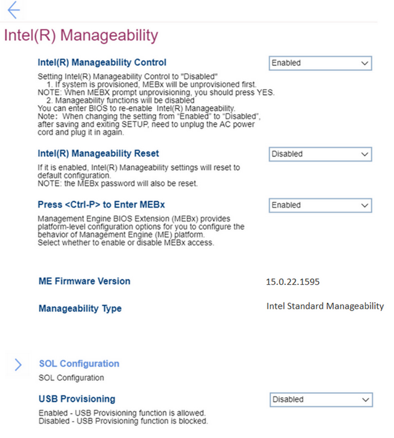

# Intel(R) Manageability Settings #

Intel(R) Manageability

One of 2 possible states:

1. **Enabled** – Default. 
2. Disabled.

?> When `Disabled`:     a. If system is provisioned, MEBx (Management Engine BIOS Extension) will be unprovisioned first.     b. Manageability functions will be disabled. You can enter BIOS to re-enable Intel(R) Manageability. 

!> When changing from `Enabled` to `Disabled`, after saving and existing SETUP, you need to unplug the AC power cord and plug it in again.

| WMI Setting name | Values | SVP Req'd | AMD/Intel |
|:---|:---|:---|:---|
|  |  |  | Intel |

Intel(R) Manageability Reset

One of 2 possible states:

1. Enabled.
2. **Disabled** – Default. 

!> When `Enabled`, Intel(R) Manageability settings will reset to default configuration.  The MEBx password will also be reset. 

| WMI Setting name | Values | SVP Req'd | AMD/Intel |
|:---|:---|:---|:---|
|  |  |  | Intel |

Press < Ctrl-P > to Enter MEBx

Management Engine BIOS Extension (MEBx) provides platform-level configuration options for you to configure the behavior of Management Engine (ME) platform.

One of 2 possible states:

1. **Enabled** – Default.
2. Disabled. 

| WMI Setting name | Values | SVP Req'd | AMD/Intel |
|:---|:---|:---|:---|
|  |  |  | Intel |

ME Firmware Version

Management Engine (ME) Firmware version. View only.

| WMI Setting name | Values | SVP Req'd | AMD/Intel |
|:---|:---|:---|:---|
|  |  |  | Intel |

Manageability Type

Manageability Type. View only. Possible values:

1. None
2. Intel(R) AMT
3. Intel(R) Standard Manageability
4. Intel(R) Level III Manageability Upgrade

| WMI Setting name | Values | SVP Req'd | AMD/Intel |
|:---|:---|:---|:---|
|  |  |  | Intel |

SOL Configuration

SOL (Serial over LAN) configuration group of settings. 

Console Type

One of 7 possible options to specify console type:

1. VT100
2. VT100-8bit
3. PC-ANSI-7bit
4. PC-ANSI
5. **VT100+** – Default.
6. VT-UTF8
7. ASCII

| WMI Setting name | Values | SVP Req'd | AMD/Intel |
|:---|:---|:---|:---|
|  |  |  | Intel |

USB Provisioning 

One of 2 possible states:

1. Enabled – USB provisioning function is allowed.
2. **Disabled** – USB provisioning function is blocked. Default.

| WMI Setting name | Values | SVP Req'd | AMD/Intel |
|:---|:---|:---|:---|
|  |  |  | Intel |

