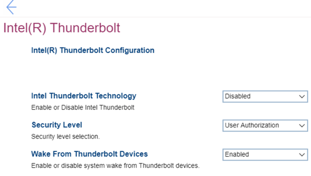

# Intel(R) Thunderbolt #

Intel Thunderbolt Technology

One of 2 possible states:

1. Enabled – Intel(R) Thunderbolt technology is enabled.
2. **Disabled** – Default. 

More information is available on official Intel websites: [Thunderbolt Technology](https://www.intel.com/content/www/us/en/architecture-and-technology/thunderbolt/overview.html), [Thunderbolt Technology for Developers](https://www.intel.com/content/www/us/en/architecture-and-technology/thunderbolt/thunderbolt-technology-developer.html), [Thunderbolt Solution Briefs](https://www.thunderbolttechnology.net/tech).

| WMI Setting name | Values | SVP Req'd | AMD/Intel |
|:---|:---|:---|:---|
|  |  |  | Intel |

Security Level

One of 4 options to select security level:

1. **No Security** – Default. Automatically connect devices plugged into the Thunderbolt port.
2. User Authorization - Approval is required for any new devices connected to the Thunderbolt port.
3. Secure Connect - The Thunderbolt adapter port will only allow connection to devices that have been configured with a shared key.
4. Display Port only - Automatically connect to Display Port devices only. No Thunderbolt adapter or PCIe devices are allowed to connect.

| WMI Setting name | Values | SVP Req'd | AMD/Intel |
|:---|:---|:---|:---|
|  |  |  | Intel |

Wake From Thunderbolt Devices

One of 2 possible states:

1. **Enabled** – Default. 
2. Disabled

| WMI Setting name | Values | SVP Req'd | AMD/Intel |
|:---|:---|:---|:---|
|  |  |  | Intel |

