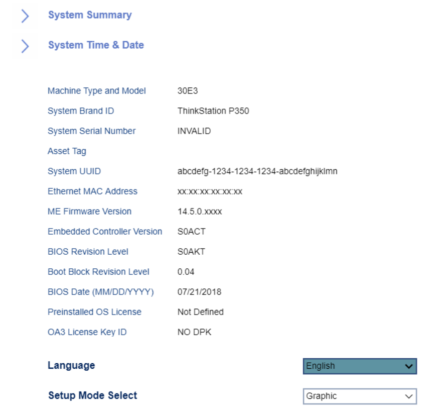

# Main #

Language

Options:

1. **English** - Default.
1. Français
1. Pусский
1. 中文

| WMI Setting name | Values | SVP / SMP Req'd | AMD/Intel |
|:---|:---|:---|
|  |  | yes |

Setup Mode Select

Options:

1. **Graphic** - Default.
1. Text

| WMI Setting name | Values | SVP / SMP Req'd | AMD/Intel |
|:---|:---|:---|
|  |  | yes |

Setup Content

description.

Options:

1.  **Advanced** - Default.
2.  Basic

