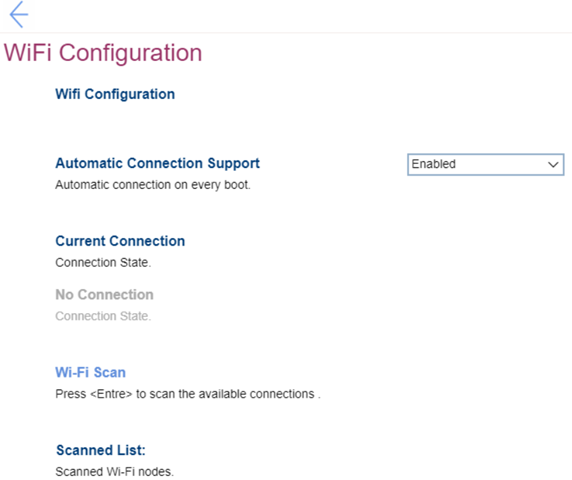

# Network Setup #
### General ###

Onboard Ethernet Controller

One of 2 states for the Onboard Ethernet Controller:

1. **Enabled** – Default. 
2. Disabled – if selected, then: 
    •"PXE IPV4 Network Stack" setting becomes unavailable 
    •"PXE IPV6 Network Stack" setting becomes unavailable 
    **Note**. The Intel(R) AMT related functions will be disabled. 

| WMI Setting name | Values | SVP Req'd | AMD/Intel |
|:---|:---|:---|:---|
|  |  |  | Both |

Wireless LAN Access

One of 2 states for the Wireless LAN Access:

1. **Enabled** – enables use of Wireless LAN. Default. 
2. Disabled – disables use of Wireless LAN. Wireless LAN will not be available in OS.

| WMI Setting name | Values | SVP Req'd | AMD/Intel |
|:---|:---|:---|:---|
|  |  |  | Both |

Wireless LAN PXE boot

One of 2 states to select whether to load Wireless LAN (Local Area Network) UNDI (Universal Network Driver Interface) Driver to support wireless LAN PXE (Pre-boot Execution Environment) boot or https boot:

1. Enabled – enables wireless LAN PXE boot.
2. **Disabled** – Default.

| WMI Setting name | Values | SVP Req'd | AMD/Intel |
|:---|:---|:---|:---|
|  |  |  | Both |

Wireless Certified Information

Wireless device information. View only.

**Note**. Applicable only for platforms which have WLAN implemented.

| WMI Setting name | Values | SVP Req'd | AMD/Intel |
|:---|:---|:---|:---|
|  |  |  | Both |

PXE IPV4 Network Stack

One of 2 states for PXE IPV4 network stack:

1. **Enabled** – Default.
2. Disabled 

**Note**. The setting is unavailable if "Onboard Ethernet Controller" is set to "Disabled".

| WMI Setting name | Values | SVP Req'd | AMD/Intel |
|:---|:---|:---|:---|
|  |  |  | Both |

PXE IPV6 Network Stack

One of 2 states for PXE IPV6 network stack:

1. **Enabled** – Default.
2. Disabled

**Note**. The setting is unavailable if "Onboard Ethernet Controller" is set to "Disabled".

| WMI Setting name | Values | SVP Req'd | AMD/Intel |
|:---|:---|:---|:---|
|  |  |  | Both |

HTTPs Boot

One of 2 states:

1. Enabled – the "HTTPs Boot Configuration" and "Tls Auth Configuration" will be shown for custom configuration.
2. **Disabled** – Default.

| WMI Setting name | Values | SVP Req'd | AMD/Intel |
|:---|:---|:---|:---|
|  |  |  | Both |

Lenovo Cloud Services

Setting is available only if "Secure Boot" has "Enabled" status. 
One of 2 states for the Lenovo Cloud Services:

1. Enabled – boot up the system with "Lenovo Cloud" selected through boot menu, BIOS would boot to Lenovo Cloud server directly which provides various cloud services.
2. **Disabled** – Default. 

**Additional information.**
Once the feature is enabled, then it becomes available for selection in "BIOS -> Startup -> Edit Boot Order", or "BIOS -> Startup -> Network Boot", or via F12 Boot Menu.  
When "Lenovo Cloud Services" booted, then following options will be available for selection:
1. **Lenovo Cloud Deploy (ITC)** – it is a method to send Factory-Style images to customers for deployment in the field. 
Additional information is available here: [Lenovo Cloud Deploy](https://www.lenovoclouddeploy.com/en/auth/welcome).
2. **Windows Virtual Desktop (VDI)** – it provides the VDI environment to customer. VDI itself will be setup by the customer (IT Admin). If this option is selected, then it will become available as a boot option.  
Additional information is available here: [Client Virtualization & Infrastructure Solutions - Lenovo](https://www.lenovo.com/lt/lt/data-center/solutions/client-virtualization) and [Windows Virtual Desktop](https://www.microsoft.com/en-us/microsoft-365/blog/2019/09/30/windows-virtual-desktop-generally-available-worldwide/).

| WMI Setting name | Values | SVP Req'd | AMD/Intel |
|:---|:---|:---|:---|
|  |  |  | Both |

Win VDI Boot

One of 2 states for Win VDI (Virtual Desktop Infrastructure) Boot:

1. Enabled – boot up the system with “Win VDI Boot” selected through boot menu, BIOS would boot to Lenovo Cloud server to load VDI service.
2. **Disabled** – Default. 

| WMI Setting name | Values | SVP Req'd | AMD/Intel |
|:---|:---|:---|:---|
|  |  |  | Both |

### HTTPs Boot Configuration ###
 <!-- Need to add image  -->

Tls Auth Configuration

Visible only if "HTTPs Boot" has "Enabled" status. 
Press <Enter> to configure Server CA (Certificate Authority) for HTTPs Boot. 

### Wi-Fi Configuration ###
