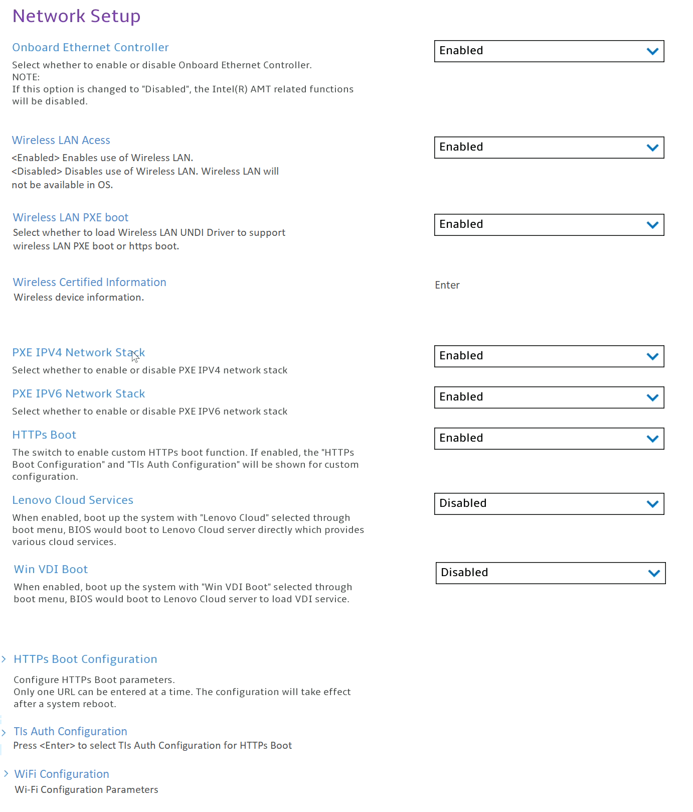

# Network Setup #

Onboard Ethernet Controller

One of 2 states for the Onboard Ethernet Controller:

1. **Enabled** – Default. 
2. Disabled – if selected, then: 
    •"PXE IPV4 Network Stack" setting becomes unavailable 
    •"PXE IPV6 Network Stack" setting becomes unavailable 
    **Note**. The Intel(R) AMT related functions will be disabled. 

| WMI Setting name | Values | SVP Req'd | AMD/Intel |
|:---|:---|:---|:---|
|  |  |  | Both |

Wireless LAN Access

One of 2 states for the Wireless LAN Access:

1. **Enabled** – enables use of Wireless LAN. Default. 
2. Disabled – disables use of Wireless LAN. Wireless LAN will not be available in OS.

| WMI Setting name | Values | SVP Req'd | AMD/Intel |
|:---|:---|:---|:---|
|  |  |  | Both |

Wireless LAN PXE boot

One of 2 states to select whether to load Wireless LAN (Local Area Network) UNDI (Universal Network Driver Interface) Driver to support wireless LAN PXE (Pre-boot Execution Environment) boot or https boot:

1. Enabled – enables wireless LAN PXE boot.
2. **Disabled** – Default.

| WMI Setting name | Values | SVP Req'd | AMD/Intel |
|:---|:---|:---|:---|
|  |  |  | Both |

Wireless Certified Information

Wireless device information. View only.

**Note**. Applicable only for platforms which have WLAN implemented.

| WMI Setting name | Values | SVP Req'd | AMD/Intel |
|:---|:---|:---|:---|
|  |  |  | Both |

