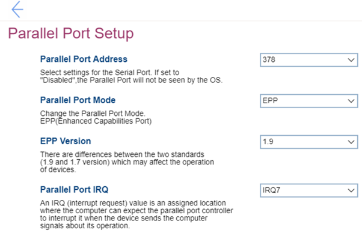

# Parallel Port Setup Settings #

Parallel Port Address

One of 3 possible options to define settings for the Parallel Port:

1. Disabled – if selected, then the Parallel Port will not be seen by the OS, and “Parallel Port Mode”,  “EPP Version” and “Parallel Port IRQ” will become unavailable. 
2. **378** – Default. 
3. 278

| WMI Setting name | Values | SVP Req'd | AMD/Intel |
|:---|:---|:---|:---|
|  |  |  | Both |

Parallel Port Mode

Parallel Port Mode, one option:

1. **EPP** - Enhanced Parallel Port. Default. 

| WMI Setting name | Values | SVP Req'd | AMD/Intel |
|:---|:---|:---|:---|
|  |  |  | Both |

EPP Version

One of 2 possible options to select a standard which may affect the operation of devices:

1. **1.9** – Default.
2. 1.7

| WMI Setting name | Values | SVP Req'd | AMD/Intel |
|:---|:---|:---|:---|
|  |  |  | Both |

Parallel Port IRQ

An IRQ (interrupt request) value is an assigned location where the computer can expect the parallel port controller to interrupt it when the device sends the computer signals about its operation.  
One of 2 possible options:

1. **IRQ7** – Default.
2. IRQ5

| WMI Setting name | Values | SVP Req'd | AMD/Intel |
|:---|:---|:---|:---|
|  |  |  | Both |

