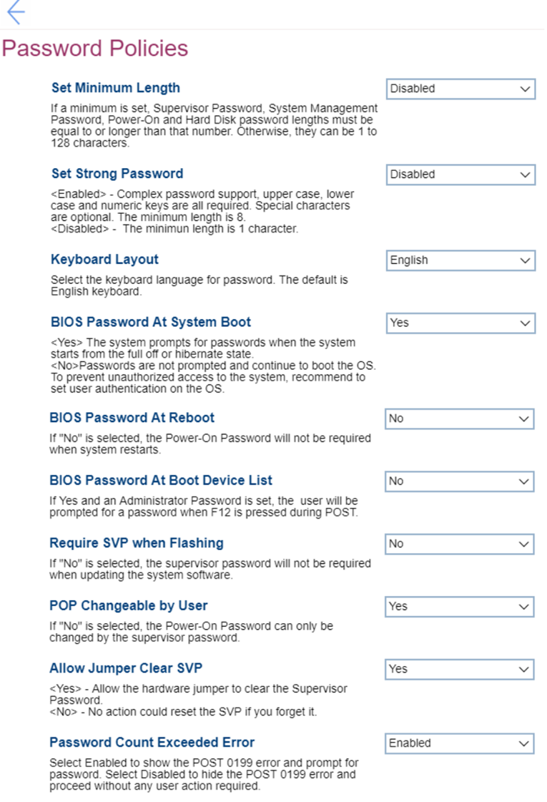

# Password Policies Settings #

Set Minimum Length

One of 10 options:

1. **Disabled** – passwords can have length from 1 to 128 characters, no requirements for the minimum length. Default. 
2. 4 Characters
3. 5 Characters
4. 6 Characters
5. 7 Characters
6. 8 Characters
7. 9 Characters
8. 10 Characters
9. 11 Characters
10. 12 Characters

**Note**. If a minimum is set, then Supervisor Password (SVP), System Management Password (SMP), Power-On Password (PoP), and Hard Disk Password (HDP) lengths must be equal to or longer than that number.

| WMI Setting name | Values | SVP Req'd | AMD/Intel |
|:---|:---|:---|:---|
|  |  |  | Both |

Set Strong Password

One of 2 states:

1. Enabled – complex password support, upper case, lower case, and numeric keys are all required. Special characters are optional. The minimum length is 8.
2. **Disabled** – the minimum length is 1 character. Default. 

| WMI Setting name | Values | SVP Req'd | AMD/Intel |
|:---|:---|:---|:---|
|  |  |  | Both |

Keyboard Layout

One of 4 options to select the keyboard language for password:

1. **English** – Default.
2. French
3. German
4. Chinese

| WMI Setting name | Values | SVP Req'd | AMD/Intel |
|:---|:---|:---|:---|
|  |  |  | Both |

BIOS Password At System Boot

One of 2 options:

1. **Yes** – the system prompts for passwords when the system starts from the full off or hibernate state. Default. 
2. No – passwords are not prompted and continue to boot the OS. To prevent unauthorized access to the system recommend to set user authentication on the OS. 

| WMI Setting name | Values | SVP Req'd | AMD/Intel |
|:---|:---|:---|:---|
|  |  |  | Both |

BIOS Password At Reboot

One of 2 options:

1. Yes – Power-On Password will be required when system restarts.
2. **No** – Power-On Password will not be required when system restarts. Default.

| WMI Setting name | Values | SVP Req'd | AMD/Intel |
|:---|:---|:---|:---|
|  |  |  | Both |

BIOS Password At Boot Device List

One of 2 options:

1. Yes – if selected and Administrator Password is set, then user will be prompted for a password when F12 is pressed during POST (Power On Self Test). 
2. **No** – no password will be required when pressed F12 during POST. Default.

| WMI Setting name | Values | SVP Req'd | AMD/Intel |
|:---|:---|:---|:---|
|  |  |  | Both |

Require SVP when Flashing

One of 2 options:

1. Yes – the supervisor password will be required when updating the system software.
2. **No** – the supervisor password will not be required when updating the system software. Default.

| WMI Setting name | Values | SVP Req'd | AMD/Intel |
|:---|:---|:---|:---|
|  |  |  | Both |

POP Changeable by User

One of 2 options:

1. **Yes** – the Power-On Password can be changed without supervisor password. Default.
2. No – the Power-On Password can only be changed by the supervisor password.

| WMI Setting name | Values | SVP Req'd | AMD/Intel |
|:---|:---|:---|:---|
|  |  |  | Both |

Allow Jumper Clear SVP

One of 2 options:

1. **Yes** – allow the hardware jumper to clear the Supervisor Password. Default.
2. No – no action could reset the SVP if user forgets it.

| WMI Setting name | Values | SVP Req'd | AMD/Intel |
|:---|:---|:---|:---|
|  |  |  | Both |

Password Count Exceeded Error

One of 2 states:

1. **Enabled** – select this option to show the POST 0199 error and prompt for password. Default.
2. Disabled – Select to hide the POST 0199 error and proceed without any user action required.

?> If "Password count Exceed Error" is enabled, then after the 3 attempts with incorrect password system will show 0199 error.  
By pressing F2 the error can be bypassed, and user can work with the system. But 0199 error will be shown until someone enters bios with correct SVP to clear the error condition by pressing F10 or save the settings after this have been verified.
In case a user wants to change bios settings and uses the wrong password, the system will deny access and after the third wrong password all other attempts will be neglected. No further changes can be made then, and user needs to reboot.

| WMI Setting name | Values | SVP Req'd | AMD/Intel |
|:---|:---|:---|:---|
|  |  |  | Both |

