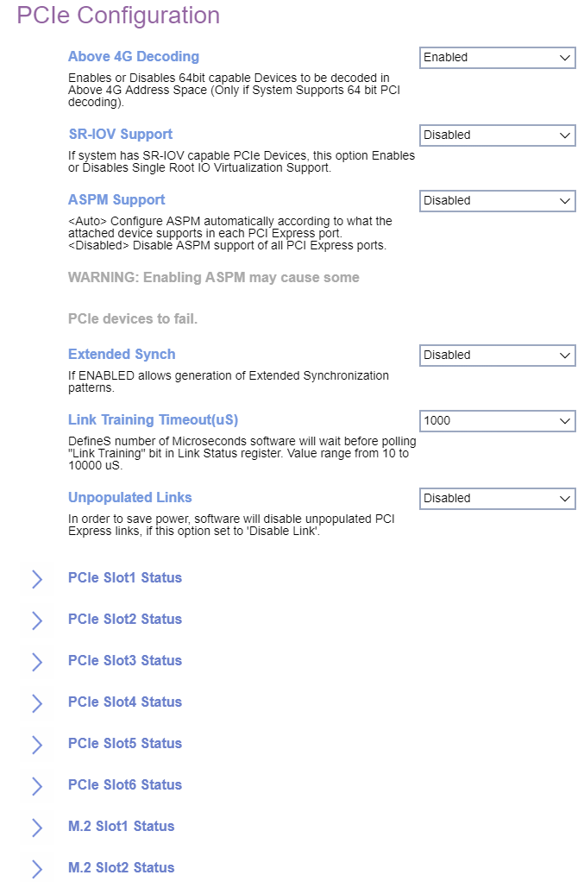
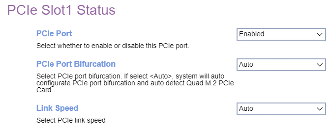
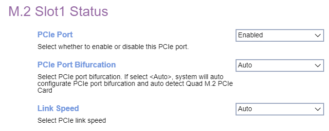

# PCIe Configuration #

Above 4G Decoding

Whether to enable 64bit capable devices to be decoded in Above 4G Address Space (only if system supports 64bit PCI decoding).

Options:

1.  **Enabled** - Default.
2.  Disabled.

<!-- | WMI Setting name | Values | SVP or SMP Req'd | AMD/Intel |
|:---|:---|:---|:---|
| setting_name | setting_values | yes_no | both | -->

SR-IOV Support

Whether to enable Single Root IO Virtualization Support.

?> Assumes system has SR-IOV capable PCIe Devices.

Options:

1.  **Disabled** - Default.
2.  Enabled.

| WMI Setting name | Values | SVP or SMP Req'd | AMD/Intel |
|:---|:---|:---|:---|
| SRIOVSupport | Disable, Enable | yes | AMD |

ASPM Support

?> When set to `Auto`, configures ASPM automatically according to what each device supports.

Options:

1.  **Disabled** - Default.
2.  Auto.

| WMI Setting name | Values | SVP or SMP Req'd | AMD/Intel |
|:---|:---|:---|:---|
| ASPMSupport | Disabled,Auto | yes | AMD |

!> Enabling ASPM may cause some PCIe devices to fail.

Extended Synch

Whether to allow generation of Extended Synchronization patterns.

Options:

1.  **Disabled** - Default.
2.  Enabled.

<!-- | WMI Setting name | Values | SVP or SMP Req'd | AMD/Intel |
|:---|:---|:---|:---|
| setting_name | setting_values | yes_no | both | -->

Link Training Timeout (uS)

How many microseconds software will wait before polling 'Link Training' bit in Link Status register.

Value range: 10 to 10000 μs.

Options:

1. 1000

<!-- TODO: verify this -->

<!-- | WMI Setting name | Values | SVP or SMP Req'd | AMD/Intel |
|:---|:---|:---|:---|
| setting_name | setting_values | yes_no | both | -->

Unpopulated Links

?> When `Disabled`, unpopulated PCI Express links are disabled to save power.

Options:

1. Keep Link ON
1. **Disabled**

<!-- | WMI Setting name | Values | SVP or SMP Req'd | AMD/Intel |
|:---|:---|:---|:---|
| setting_name | setting_values | yes_no | both | -->

### PCIe Slot{X} Status ###

?> X represents the slot number, from 1 to 6.

PCIe Port

Whether to enable this PCIe port.

Options:

1.  **Enabled** - Default.
2.  Disabled.

| WMI Setting name | Values | SVP or SMP Req'd | AMD/Intel |
|:---|:---|:---|:---|
| PCIeSlotXPort | Disable, Enable | yes | AMD |

!> In the WMI class name, X represents the slot number, from 1 to 6.

PCIe Port Bifurcation

Select PCIe port bifurcation.

!> If `Auto`, system will auto-configure PCIe port bifurcation and auto-detect Quad M.2 PCIe Card.

Options:

1. x4x4x4x4
1. x4x4x8
1. x8x4x4
1. x8x8
1. x16
1. Auto

| WMI Setting name | Values | SVP or SMP Req'd | AMD/Intel |
|:---|:---|:---|:---|
| PCIeSlotXBifurcation | Auto, x8, x4x4 | yes | AMD |

!> In the WMI class name, X represents the slot number, from 1 to 6.

Link Speed

description.

Options:

1.  **Disabled** - Default.
2.  Enabled.

| WMI Setting name | Values | SVP or SMP Req'd | AMD/Intel |
|:---|:---|:---|:---|
| PCIeSlotXLinkSpeed | Auto, Gen 1 (2.5 GT/s), Gen 2 (5 GT/s), Gen 3 (8 GT/s), Gen 4 (16 GT/s) | yes | AMD |

!> In the WMI class name, X represents the slot number, from 1 to 6.

### M.2 Slot{Y} Status ###

?> Y represents the slot number, 1 or 2.

PCIe Port

Whether to enable this PCIe port.

Options:

1.  **Enabled** - Default.
2.  Disabled.

| WMI Setting name | Values | SVP or SMP Req'd | AMD/Intel |
|:---|:---|:---|:---|
| M2SlotYPort | Disable, Enable | yes | AMD |

!> In the WMI class name, Y represents the slot number, 1 or 2.

PCIe Port Bifurcation

Select PCIe port bifurcation.

!> If `Auto`, system will auto-configure PCIe port bifurcation and auto-detect Quad M.2 PCIe Card.

Options:

1. x4x4x4x4
1. x4x4x8
1. x8x4x4
1. x8x8
1. x16
1. Auto

| WMI Setting name | Values | SVP or SMP Req'd | AMD/Intel |
|:---|:---|:---|:---|
| M2SlotYBifurcation | Auto, x8, x4x4 | yes | AMD |

Link Speed

description.

Options:

1.  **Disabled** - Default.
2.  Enabled.

| WMI Setting name | Values | SVP or SMP Req'd | AMD/Intel |
|:---|:---|:---|:---|
| M2SlotYLinkSpeed | Auto, Gen 1 (2.5 GT/s), Gen 2 (5 GT/s), Gen 3 (8 GT/s), Gen 4 (16 GT/s) | yes | AMD |

!> In the WMI class name, Y represents the slot number, 1 or 2.

