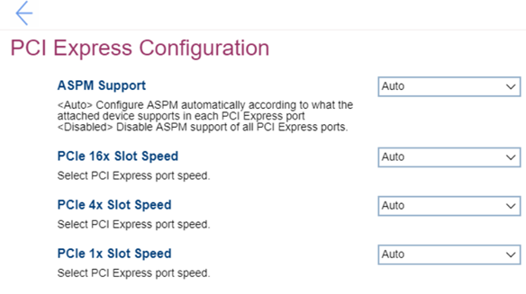

# PCI Express Configuration Settings #

ASPM Support

ASPM (Active State Power Management).

Options:

1. **Auto** – configure ASPM automatically according to what the attached device supports in each PCI (Peripheral Component Interconnect) Express port. Default.
2. Disabled – Disable ASPM support of all PCI Express ports. 

| WMI Setting name | Values | SVP Req'd | AMD/Intel |
|:---|:---|:---|:---|
|  |  |  | Both |

PCIe 16x Slot Speed

One of 5 options to select PCI Express port speed:

1. **Auto** – Default. 
2. Gen 1
3. Gen 2
4. Gen 3
5. Gen 4

| WMI Setting name | Values | SVP Req'd | AMD/Intel |
|:---|:---|:---|:---|
|  |  |  | Both |

PCIe 4x Slot Speed

One of 4 options to select PCI Express port speed:

1. **Auto** – Default. 
2. Gen 1
3. Gen 2
4. Gen 3

| WMI Setting name | Values | SVP Req'd | AMD/Intel |
|:---|:---|:---|:---|
|  |  |  | Both |

PCIe 1x Slot Speed

One of 4 options to select PCI Express port speed:

1. **Auto** – Default. 
2. Gen 1
3. Gen 2
4. Gen 3

| WMI Setting name | Values | SVP Req'd | AMD/Intel |
|:---|:---|:---|:---|
|  |  |  | Both |

PCIe {Generation} Slot Speed
 <!-- TODO: confirm Gen = Generation -->
The {Generation} is the item name based on the motherboard silkscreen. 
One of 4 options:

1. **Auto** – Default. 
2. Gen 1
3. Gen 2
4. Gen 3

| WMI Setting name | Values | SVP Req'd | AMD/Intel |
|:---|:---|:---|:---|
| PCIe{Generation}Slot1Speed |  |  | Both |

