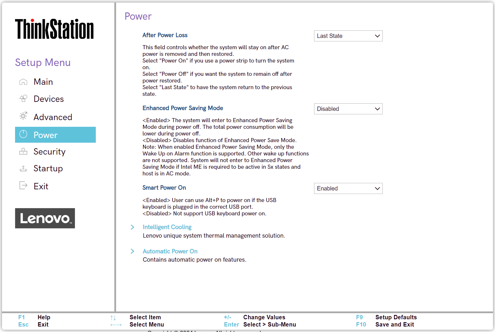
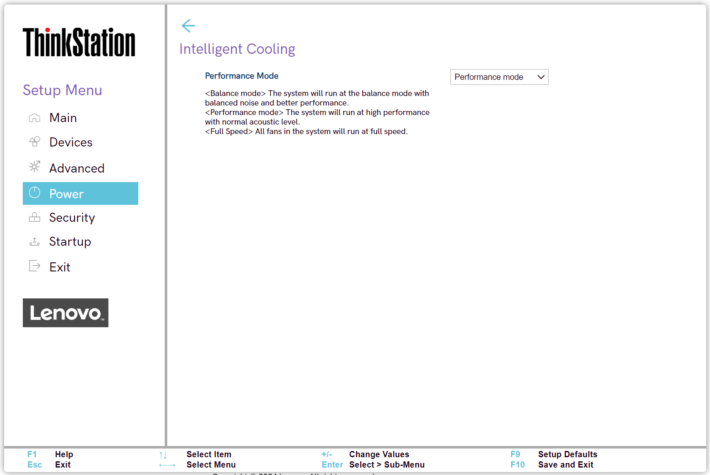

# Power #

After Power Loss

One of 3 options to select whether the system will stay on after AC power is removed and then restored:

1. Power On – select this option if you use a power strip to turn the system on.
2. Power Off – select this option if you want the system to remain off after power restored.
3. **Last State** – select this option to have the system return to the previous state. Default.

| WMI Setting name | Values | SVP Req'd | AMD/Intel |
|:---|:---|:---|:---|
|  |  |  | Both |

Enhanced Power Saving Mode

One of 2 states:

1. Enabled – the system will enter to Enhanced Power Saving Mode during power off. The total power consumption will be lower during power off. 
2. **Disabled** – disables the function of Enhanced Power Save Mode. Default.

**Note**: When enabled "Enhanced Power Saving Mode", only the "Wake Up on Alarm" function is supported. Other wake up functions are not supported. System will not enter to "E"nhanced Power Saving Mode" if Intel ME (Management Engine) is required to be active in Sx states (aka Sleep states) and host is in AC mode.

| WMI Setting name | Values | SVP Req'd | AMD/Intel |
|:---|:---|:---|:---|
|  |  |  | Both |

Smart Power On

One of 2 states:

1. **Enabled** – if selected, then user can use Alt+P power on in the USB keyboard is plugged in the correct USB port. Default.
2. Disabled – if selected, then system does not support USB keyboard power on.

| WMI Setting name | Values | SVP Req'd | AMD/Intel |
|:---|:---|:---|:---|
|  |  |  | Both |

Intelligent Cooling

Group of settings for Lenovo unique system thermal management solution. 

Performance Mode

One of 3 options:

1. **Best performance** – the system will run at best system performance with normal acoustic level. Default.
2. Best experience – the system will run at the best experience with balanced noise and better performance.
3. Full Speed – all fans in the system will rung at full speed. 

| WMI Setting name | Values | SVP Req'd | AMD/Intel |
|:---|:---|:---|:---|
|  |  |  | Both |

