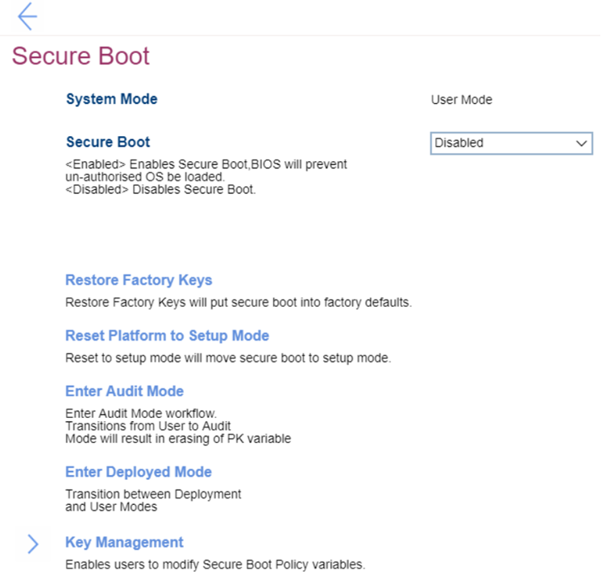

# Secure Boot Settings #
### General ###

System Mode

Shows the current system mode. View only. 
Possible values:

1. **Deployed Mode** - Default
2. Audit  Mode
3. User Mode
4. Setup Mode

| WMI Setting name | Values | SVP Req'd | AMD/Intel |
|:---|:---|:---|:---|
|  |  |  | Both |

Secure Boot

One of 2 states:

1. **Enabled** – enables Secure Boot, BIOS will prevent un-authorized OS be loaded. Default.
2. Disabled – disables Secure Boot.

| WMI Setting name | Values | SVP Req'd | AMD/Intel |
|:---|:---|:---|:---|
|  |  |  | Both |

Restore Factory Keys

Reset Factory Keys will put secure boot into factory defaults. 

**Note**. It will require additional confirmation. 

| WMI Setting name | Values | SVP Req'd | AMD/Intel |
|:---|:---|:---|:---|
|  |  |  | Both |

Reset Platform to Setup Mode

Reset to setup mode will move secure boot to setup mode. 

**Note**. It will require additional confirmation.

| WMI Setting name | Values | SVP Req'd | AMD/Intel |
|:---|:---|:---|:---|
|  |  |  | Both |

Enter Audit Mode

The option will enter Audit Mode workflow. 
Transition from User to Audit Mode will result in erasing of PK (Platform Key) value.  

**Note**. It will require additional confirmation.

| WMI Setting name | Values | SVP Req'd | AMD/Intel |
|:---|:---|:---|:---|
|  |  |  | Both |

Enter Deployment Mode

Option to transition between User and Deployment modes. 

**Note**. It will require additional confirmation.

| WMI Setting name | Values | SVP Req'd | AMD/Intel |
|:---|:---|:---|:---|
|  |  |  | Both |

### Key Management ###
<!-- TBD need to find the image -->

Platform Key (PK)

The platform key establishes a trust relationship between the platform owner and the platform firmware. The platform owner enrolls the public half of the key into the platform firmware. The platform owner can later use the private half of the key to change platform ownership or to enroll a Key Exchange Key. 

| WMI Setting name | Values | SVP Req'd | AMD/Intel |
|:---|:---|:---|:---|
|  |  |  | Both |

Key Exchange Key (KEK)

Key exchange keys establish a trust relationship between the operating system and the platform firmware. Each operating system (and potentially, each 3rd party application that needs to communicate with platform firmware) enrolls a public key into the platform firmware.

| WMI Setting name | Values | SVP Req'd | AMD/Intel |
|:---|:---|:---|:---|
|  |  |  | Both |

Authorized Signature Database (DB)

Database keys shows the list of allowed certificates. System will check digital signatures of bootloaders using public keys in the DB. Only software or firmware which has a bootloader signed with a corresponding private key will be allowed to run. 

| WMI Setting name | Values | SVP Req'd | AMD/Intel |
|:---|:---|:---|:---|
|  |  |  | Both |

Forbidden Signature Database (DBX)

Forbidden Signature Database shows not allowed certificates. System will block any software or firmware signed with a corresponding private key. 

| WMI Setting name | Values | SVP Req'd | AMD/Intel |
|:---|:---|:---|:---|
|  |  |  | Both |

Authorized TimeStamps (DBt)

If present, contains the platform-defined secure boot timestamp signature database. This is not used at runtime but is provided in order to allow the OS to recover the OEM's default key setup.

| WMI Setting name | Values | SVP Req'd | AMD/Intel |
|:---|:---|:---|:---|
|  |  |  | Both |

OsRecovery Signatures (DBr)

If present, contains the platform-defined secure boot authorized recovery signature database. This is not used at runtime but is provided in order to allow the OS to recover the OEM's default key setup.

| WMI Setting name | Values | SVP Req'd | AMD/Intel |
|:---|:---|:---|:---|
|  |  |  | Both |

