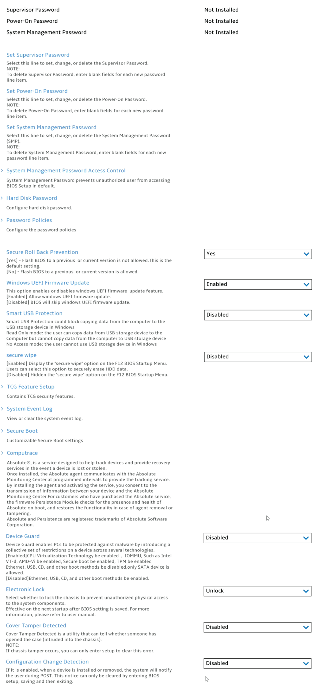
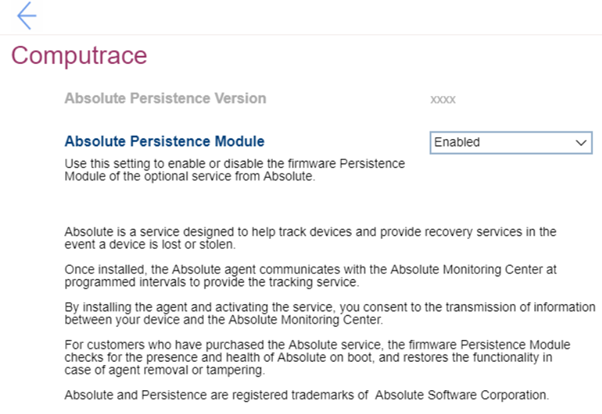

# Security #

Supervisor Password

The supervisor password (SVP) protects the system information stored in UEFI BIOS. When entering the UEFI BIOS menu, enter the correct supervisor password in the window prompted. You also can press Enter to
skip the password prompt. However, you cannot change most of the system configuration options in UEFI
BIOS.

**The supervisor password can be set only through the UEFI BIOS menu**. Once it is in place, then it can be modified Windows Management Instrumentation (WMI) with the Lenovo client-management interface.

If you have set both the supervisor password and power-on password, you can use the supervisor password to access your computer when you turn it on. The supervisor password overrides the power-on password. 

View only. Shows the current password state. Possible values:

1.  Not Installed 
2. Installed

| WMI Setting name | Values | SVP Req'd | AMD/Intel |
|:---|:---|:---|:---|
|  |  |  | Both |

Power-On Password

Power-On Password prevents unauthorized users from booting your computer.

View only. Shows the current password state. Possible values:

1. Not Installed 
2. Installed

| WMI Setting name | Values | SVP Req'd | AMD/Intel |
|:---|:---|:---|:---|
|  |  |  | Both |

System Management Password

The system management password (SMP) can also protect the system information stored in UEFI BIOS like a supervisor password, but it has lower authority by default.

The system management password can be set through the UEFI BIOS menu or through Windows Management Instrumentation (WMI) with the Lenovo client-management interface. You can enable the system management password to have the same authority as the supervisor password to control security-related features.

View only. Shows the current password state. Possible values:
1. Not Installed 
2. Installed

| WMI Setting name | Values | SVP Req'd | AMD/Intel |
|:---|:---|:---|:---|
|  |  |  | Both |

Set Supervisor Password

Option to set, change or delete the Supervisor Password (SVP). 

**Note**. To delete Supervisor Password, enter blank fields foe each new password line item.

While enabling the following parameters are available:
1. [ Enter New Password ]
2. [ Confirm New Password ]
3. < Actions >: 
    a. **Save** – default 
    b. Cancel

| WMI Setting name | Values | SVP Req'd | AMD/Intel |
|:---|:---|:---|:---|
|  |  |  | Both |

Set Power-On Password

Option to set, change or delete the Power-On Password.

**Note**. To delete Power-On Password, enter blank fields for each new password line item.

While enabling the following parameters are available TBD:
1. [ Enter New Password ]
2. [ Confirm New Password ]
3. < Actions >: 
    a. **Save** – default 
    b. Cancel

| WMI Setting name | Values | SVP Req'd | AMD/Intel |
|:---|:---|:---|:---|
|  |  |  | Both |

Set System Management Password

Option to set, change or delete the System Management Password (SMP).

**Note**. To delete System Management Password, enter blank fields for each new password line item.

While enabling the following parameters are available TBD:
1. [ Enter New Password ]
2. [ Confirm New Password ]
3. < Actions >: 
    a. **Save** – default 
    b. Cancel

| WMI Setting name | Values | SVP Req'd | AMD/Intel |
|:---|:---|:---|:---|
|  |  |  | Both |

Secure Roll Back Prevention

One of 2 states:

1. **Yes** – Flash BIOS to a previous or current version is not allowed. This is the default setting.
2. No – Flash BIOS to a previous or current version is allowed.

| WMI Setting name | Values | SVP Req'd | AMD/Intel |
|:---|:---|:---|:---|
|  |  |  | Both |

Windows UEFI Firmware Update

One of 2 states:

1. **Enabled** – allow windows UEFI firmware update. Default.
2. Disabled – BIOS will skip windows UEFI firmware update.

| WMI Setting name | Values | SVP Req'd | AMD/Intel |
|:---|:---|:---|:---|
|  |  |  | Both |

Smart USB Protection

Smart USB Protection could block copying data from the computer to the USB storage device in windows. 
One of 3 modes:

1. **Disabled** – the user can copy data from and to USB storage device. Default. 
2. Read Only – the user can copy data from USB storage device to the Computer but cannot copy data from the computer to USB storage device.
3. No Access – the user cannot use USB storage device in windows.

| WMI Setting name | Values | SVP Req'd | AMD/Intel |
|:---|:---|:---|:---|
|  |  |  | Both |

Secure wipe

One of 2 states:

1. Enabled – display “secure wipe” option on the F12 BIOS Startup Menu. Users can select this option to securely erase HDD data. 
2. **Disabled** – hidden the “secure wipe” option on the F12 BIOS Startup Menu. Default. 

| WMI Setting name | Values | SVP Req'd | AMD/Intel |
|:---|:---|:---|:---|
|  |  |  | Both |

Computrace

Group of settings for Absolute Persistence Module.
Absolute(c) is a service designed to help track devices and provide recovery services in the event a device is lost or stolen.
Once installed, the Absolute agent communicates with the Absolute Monitoring Center and programmed intervals to provide the tracking service.  

By installing the agent and activating the service, you consent to the transmission of information between your device and the Absolute Monitoring Center. 

For customers who have purchased the Absolute service, the firmware Persistence Module checks for the presence and health of Absolute on boot, and restores the functionality in case of agent removal or tampering.
Absolute and Persistence are registered trademarks of Absolute Software Corporation.

Absolute Persistence Version

Shows Absolute Persistence Version. View only. 

| WMI Setting name | Values | SVP Req'd | AMD/Intel |
|:---|:---|:---|:---|
|  |  |  | Both |

Absolute Persistence Module

Use this setting to enable or disable the firmware Persistence Module of the optional service from Absolute. 

One of 3 states:

1.	**Enabled** – Absolute Persistence Module is enabled. Default. 
2.	Disabled – Absolute Persistence Module is disabled.
3.	Permanently Disabled – Absolute Persistence Module is permanently disabled. 

Selecting this option requires additional confirmation, because if Computrace activation is permanently disabled, then you can never enable this setting again.   

More information on the official site of [Absolute Software Corporation](https://www.absolute.com/partners/device-manufacturers/lenovo/).

| WMI Setting name | Values | SVP Req'd | AMD/Intel |
|:---|:---|:---|:---|
|  |  |  | Both |

Device Guard

Device Guard enables PCs to be protected against malware by introducing a collective set of restrictions on a device across several technologies.  
One of 2 states:

1. Enabled – CPU Virtualization Technology to be enabled, IOMMU (Intel Input\Output Memory Management Unit), such as Intel VT-d, AMD-Vi to be enabled, TPM to be enabled. 
Ethernet, USB, CD, and other boot methods to be disabled, only SATA device to be allowed.
2. **Disabled** – Ethernet, USB, CD, and other boot methods to be enabled. Default. 

| WMI Setting name | Values | SVP Req'd | AMD/Intel |
|:---|:---|:---|:---|
|  |  |  | Both |

Electronic Lock

One of 2 states:

1. Lock – lock the chassis to prevent unauthorized physical access to the system components. 
2. **Unlock** – the chassis is unlocked. Default. 

**Note**. The setting is effective on the next startup after BIOS setting is saved. For more information, please refer to [user manual](https://thinkstation-specs.com/thinkstation/p350-tower/). 

| WMI Setting name | Values | SVP Req'd | AMD/Intel |
|:---|:---|:---|:---|
|  |  |  | Both |

Cover Tamper Detected

Chassis Intrusion Detection is a utility that can tell whether someone has opened the case (intruded into the chassis). 
One of 2 states:

1. **Disabled** – detection is disabled. Default. 
2. Enabled – detection is enabled.

**Note**. If chassis tamper occurs, you can only enter setup to clear this error.

| WMI Setting name | Values | SVP Req'd | AMD/Intel |
|:---|:---|:---|:---|
|  |  |  | Both |

Configuration Change Detection

One of 2 states:

1. Enabled – when a device is installed or remove, the system will notify the user during POST (Power On Self Test). This notice can only be cleared by entering BIOS setup, saving, and then exiting.
2. **Disabled** – configuration change detection is disabled. Default.

| WMI Setting name | Values | SVP Req'd | AMD/Intel |
|:---|:---|:---|:---|
|  |  |  | Both |

