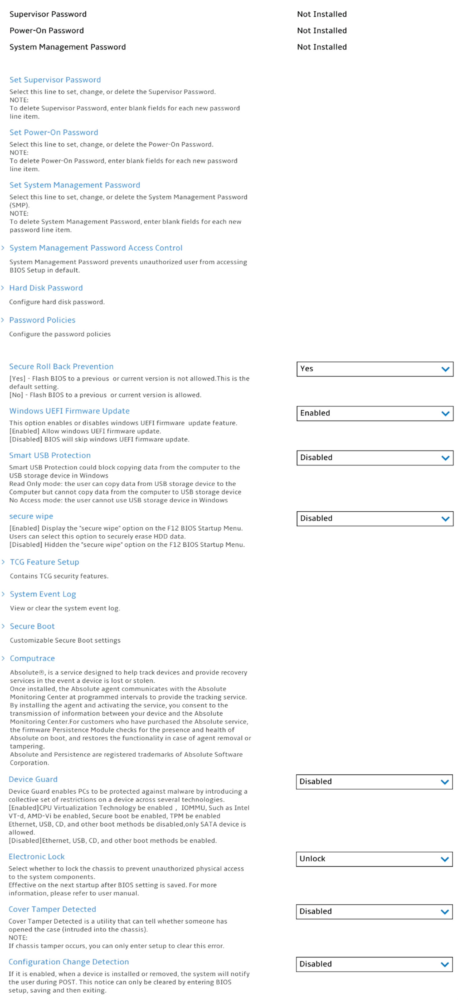

# Security #

Supervisor Password

The supervisor password (SVP) protects the system information stored in UEFI BIOS. When entering the UEFI BIOS menu, enter the correct supervisor password in the window prompted. You also can press Enter to
skip the password prompt. However, you cannot change most of the system configuration options in UEFI
BIOS.

**The supervisor password can be set only through the UEFI BIOS menu**. Once it is in place, then it can be modified Windows Management Instrumentation (WMI) with the Lenovo client-management interface.

If you have set both the supervisor password and power-on password, you can use the supervisor password to access your computer when you turn it on. The supervisor password overrides the power-on password. 

View only. Shows the current password state. Possible values:

1.  Not Installed 
2. Installed

| WMI Setting name | Values | SVP Req'd | AMD/Intel |
|:---|:---|:---|:---|
|  |  |  | Both |

Power-On Password

Power-On Password prevents unauthorized users from booting your computer.

View only. Shows the current password state. Possible values:

1. Not Installed 
2. Installed

| WMI Setting name | Values | SVP Req'd | AMD/Intel |
|:---|:---|:---|:---|
|  |  |  | Both |

System Management Password

The system management password (SMP) can also protect the system information stored in UEFI BIOS like a supervisor password, but it has lower authority by default.

The system management password can be set through the UEFI BIOS menu or through Windows Management Instrumentation (WMI) with the Lenovo client-management interface. You can enable the system management password to have the same authority as the supervisor password to control security-related features.

View only. Shows the current password state. Possible values:
1. Not Installed 
2. Installed

| WMI Setting name | Values | SVP Req'd | AMD/Intel |
|:---|:---|:---|:---|
|  |  |  | Both |

Set Supervisor Password

Option to set, change or delete the Supervisor Password (SVP). 

**Note**. To delete Supervisor Password, enter blank fields foe each new password line item.

While enabling the following parameters are available TBD:
1. [ Enter New Password ]
2. [ Confirm New Password ]
3. Show Password – [ On\Off ] statuses
4. Keyboard layout: XXXX – Possible values are the same as in Config Section | Keyboard\Mouse -> Keyboard Layout
5. <Actions>: 
    a. **Save** – default 
    b. Cancel

| WMI Setting name | Values | SVP Req'd | AMD/Intel |
|:---|:---|:---|:---|
|  |  |  | Both |

