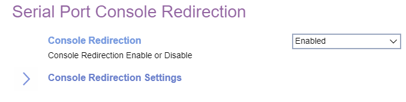
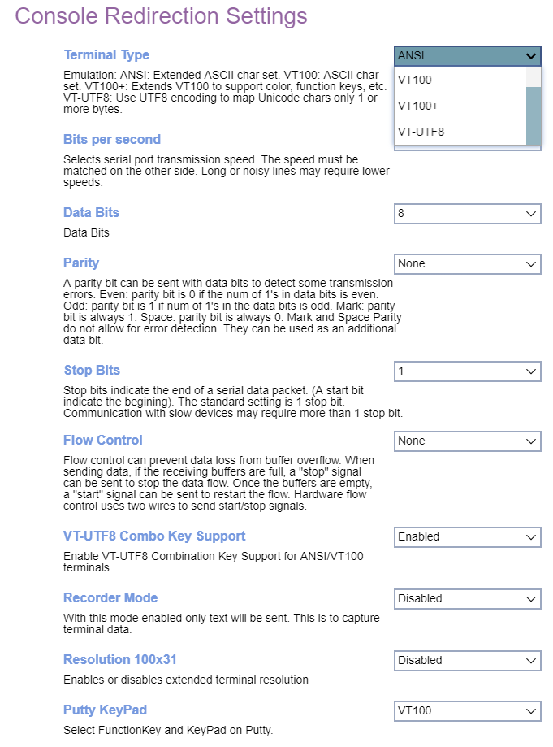

# Serial Port Console Redirection #

### Console Redirection Settings ###

Terminal Type

Options:

1. VT100
1. VT100+
1. VT-UTF8
1. ANSI

?> The following emulation types are available.   ANSI: Extended ASCII char set.   VT100: ASCII char set.   VT100+: Extends VT100 to support color, function keys, etc.   VT-UTF8: Uses UTF8 encoding to map Unicode chars onto 1 or more bytes.  

<!-- | WMI Setting name | Values | SVP or SMP Req'd | AMD/Intel |
|:---|:---|:---|:---|
| ConsoleRedirection | setting_values | yes_no | both | -->

Bits per second

Select serial port transmission speed. The speed must be matched on the other side. Long or noisy lines may require lower speeds.

Options:

1. 9600
1. 19200
1. 38400
1. 57600
1. **115200**

<!-- | WMI Setting name | Values | SVP or SMP Req'd | AMD/Intel |
|:---|:---|:---|:---|
| BitsPerSecond | setting_values | yes_no | both | -->

Data Bits

Options:

1. **8** - Default.
1. 7

<!-- | WMI Setting name | Values | SVP or SMP Req'd | AMD/Intel |
|:---|:---|:---|:---|
| DataBits | setting_values | yes | AMD | -->

Parity

Send parity bit with the data bits to detect some transmission errors.

Options:

1.  **Disabled** - Default.
2.  Enabled.

?> Details below.   Even: parity bit is 0 if the num of 1's in the data bits is even.   Odd: parity bit is 1 if the num of 1's in the data bits is odd.   Mark: parity bit is always 1.   Space: Parity bit is always 0.   

?> Mark and Space Parity do not allow for error detection.  They can be used as an additional data bit.

<!-- | WMI Setting name | Values | SVP or SMP Req'd | AMD/Intel |
|:---|:---|:---|:---|
| ParityMode | setting_values | yes | AMD | -->

Stop Bits

Stop bits indicate the end of a serial data packet. (A start bit indicates the beginning). The standard setting is 1 stop bit. Communication with slow devices may require more than 1 stop bit.

Options:

1.  **1** - Default.
2.  2.

<!-- | WMI Setting name | Values | SVP or SMP Req'd | AMD/Intel |
|:---|:---|:---|:---|
| StopBits | setting_values | yes | AMD | -->

