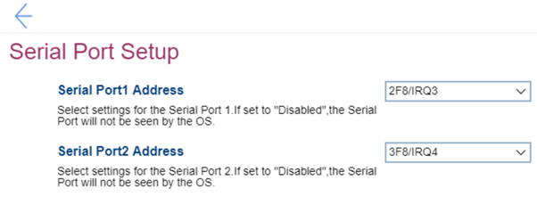

# Serial Port Setup Settings #

Serial Port1 Address

Options:

1.	Disabled – if selected, then the Serial Port will not be seen by the OS.
2.	**3F8/IRQ4** – Default.
3.	2F8/IRQ3
4.	3E8/IRQ4
5.	2E8/IRQ3

| WMI Setting name | Values | SVP / SMP Req'd | AMD/Intel |
|:---|:---|:---|:---|
| SerialPort1Address |  | yes | Both |

Serial Port2 Address

Options:

1.	Disabled – if selected, then the Serial Port will not be seen by the OS.
2.	3F8/IRQ4
3.	**2F8/IRQ3** – Default.
4.	3E8/IRQ4
5.	2E8/IRQ3

| WMI Setting name | Values | SVP / SMP Req'd | AMD/Intel |
|:---|:---|:---|:---|
| SerialPort2Address |  | yes | Both |

