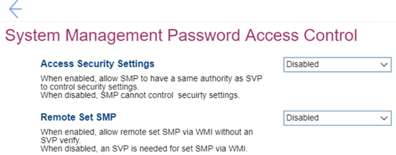

# System Management Password Access Control Settings #

Access Security Settings

One of 2 states:

1. **Disabled** – SMP cannot control security settings. Default. 
2. Enabled – allows SMP to have the same authority as SVP to control security settings.

| WMI Setting name | Values | SVP Req'd | AMD/Intel |
|:---|:---|:---|:---|
|  |  |  | Both |

Remote Set SMP

Whether an SVP is needed to set SMP via WMI.

One of 2 states:

1. **Disabled** – Default.
2. Enabled.

| WMI Setting name | Values | SVP Req'd | AMD/Intel |
|:---|:---|:---|:---|
|  |  |  | Both |

