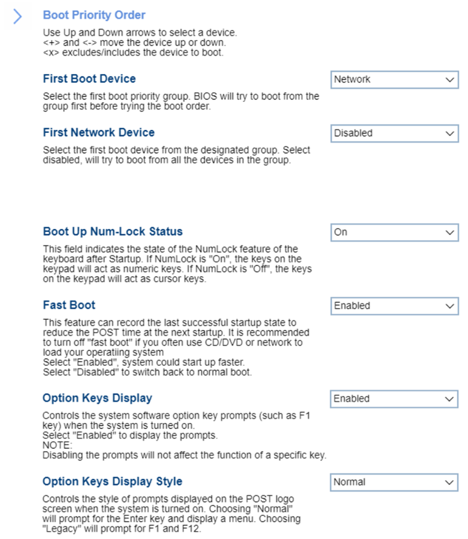

# Startup #

First Boot Device

BIOS will try to boot from the group first before trying the boot order. One of 6 options to select the first boot priority group:

1. **Boot Order** – Default. 
2. Network
3. SATA Drive
4. M.2 Drive
5. PCIE Drive
6. USB HDD
7. USB CDROM

| WMI Setting name | Values | SVP Req'd | AMD/Intel |
|:---|:---|:---|:---|
|  |  |  | Both |

First xx Device

xx means Network/SATA/M.2/PCIE. 
The available options to select the first boot device from the designated group:

1. **Disabled** – when this option is selected, then system will try to boot from all the devices in the group. Default.
2. Other options will show the relevant list of devices in the group depending on the selected item in 'First Boot Device': 'Network', 'SATA Drive', 'M.2 Drive' or 'PCIE'.

| WMI Setting name | Values | SVP Req'd | AMD/Intel |
|:---|:---|:---|:---|
|  |  |  | Both |

Boot Up Num-Lock Status

This field indicates the state of the NumLock feature of the keyboard after Startup. 
One of 2 options:

1. **On** – they keys on the keypad will act as numeric keys. Default. 
2. Off – the keys on the keyboard will act as cursor keys.

| WMI Setting name | Values | SVP Req'd | AMD/Intel |
|:---|:---|:---|:---|
|  |  |  | Both |

Fast Boot

This feature can record the last successful startup state to reduce the POST time at the next startup. It is recommended to turn off “Fast Boot” if you often use CD/DVD or network to load your operating system. 
One of 2 states:

1. **Enabled** – system could start up faster. Default. 
2. Disabled – switch back to normal boot.

| WMI Setting name | Values | SVP Req'd | AMD/Intel |
|:---|:---|:---|:---|
|  |  |  | Both |

Option Keys Display

Controls the system software option key prompts (such as F1 key) when the system is turned on. 
One of 2 states:

1. Enabled – system will display the prompts. 
2. **Disabled** – system will not display the prompts. Default.  
    **Note**. Disabling the prompts will not affect the function of a specific key.

| WMI Setting name | Values | SVP Req'd | AMD/Intel |
|:---|:---|:---|:---|
|  |  |  | Both |

Option Keys Display Style

Visible only if 'Option Keys Display' has 'Enabled' state. 

Setting to control the style of prompts displayed on the POST logo screen when the system is turned on.  
One of 2 options:

1. **Normal** – will prompt for the Enter key and display a menu. Default.
2. Legacy – will prompt for F1 and F12.

| WMI Setting name | Values | SVP Req'd | AMD/Intel |
|:---|:---|:---|:---|
|  |  |  | Both |

