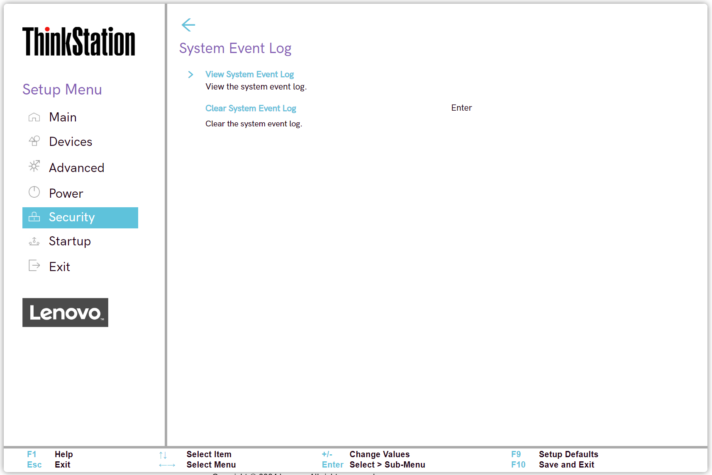
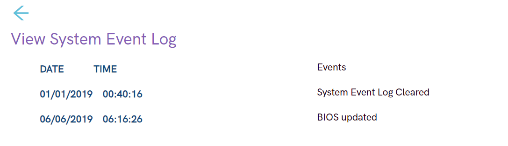

# System Event Log Settings #

View System Event Log

View only.

Shows system event logs in table with the following columns:

1. DATE – MM / DD / YYYY
2. TIME – HH : MM : SS
3. Events – description of event

| WMI Setting name | Values | SVP / SMP Req'd | AMD/Intel |
|:---|:---|:---|:---|
|  |  |  | Both |

Clear System Event Log

!> All system event logs will be cleared immediately. Requires additional confirmation.

| WMI Setting name | Values | SVP / SMP Req'd | AMD/Intel |
|:---|:---|:---|:---|
|  |  |  | Both |

