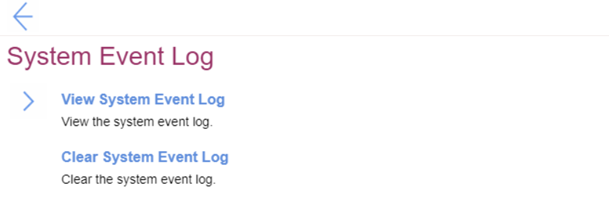
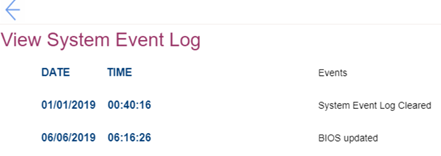

# System Event Log Settings #

View System Event Log

View only. Shows system even logs in table with the following columns:

1. DATE – MM / DD / YYYY, date of an event.
2. TIME – HH : MM : SS, time of an event.
3. Events – name of an event.

| WMI Setting name | Values | SVP / SMP Req'd | AMD/Intel |
|:---|:---|:---|:---|
|  |  |  | Both |

Clear System Event Log

!> Requires additional confirmation because all system event logs will be cleared immediately. 

| WMI Setting name | Values | SVP / SMP Req'd | AMD/Intel |
|:---|:---|:---|:---|
|  |  |  | Both |

